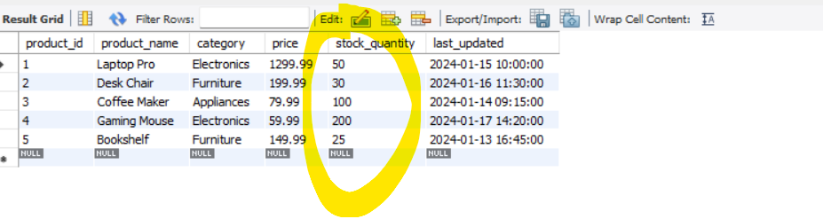

ORDER BY in MySQL: Single, Multiple Field, Function, Field, Case, Null Handling
===============================================================================

/*
SQL Sorting and ORDER BY Tutorial
================================
This SQL script demonstrates various techniques for sorting data using ORDER BY
and includes examples ranging from basic to advanced sorting concepts.
*/

create database order_by_db;
use order_by_db;

-- Create a products table with various data types

    CREATE TABLE products (
        product_id INT PRIMARY KEY,
        product_name VARCHAR(100),
        category VARCHAR(50),
        price DECIMAL(10,2),
        stock_quantity INT,
        last_updated TIMESTAMP
    );

-- Insert initial sample data

    INSERT INTO products VALUES
    (1, 'Laptop Pro', 'Electronics', 1299.99, 50, '2024-01-15 10:00:00'),
    (2, 'Desk Chair', 'Furniture', 199.99, 30, '2024-01-16 11:30:00'),
    (3, 'Coffee Maker', 'Appliances', 79.99, 100, '2024-01-14 09:15:00'),
    (4, 'Gaming Mouse', 'Electronics', 59.99, 200, '2024-01-17 14:20:00'),
    (5, 'Bookshelf', 'Furniture', 149.99, 25, '2024-01-13 16:45:00');

    select * from products;

*** It's not guarantees always we will get data in insertion order only, so always use order by for sequencing.

   
   
# sort orders by it's price in ascending order ( by default in Ascending order / ASC )
    select * from products order by price;

# we can sort with multiple columns
# we want to sort within electronics category by it's price

    select * from category, price;

# both furniture has been sorted by it's price
    select * from products order by category desc, price asc;

# case-sensitive sorting
    select * from products order by binary category;

# Sorting with Functions
    select product_name, length(product_name) from products;
  
  
# we can sort using function as well
    select * from products order by length(product_name);
  

    select * from products order by day(last_updated) desc;
  

# Order By and LIMIT
# we want highest stock quantity products
# [ Important ]
# LIMIT Clause - The LIMIT clause is used to specify the number of records to return.
# OFFSET - a powerful clause used to skip a specified number of rows in a query result.
# Order By and LIMIT
# we want highest stock quantity products
# offset uses to SKIP rows

# show all products available
    select * from products
   
    
    select * from products order by stock_quantity desc 
  

# find highest stock_quantity available products
    select * from products order by stock_quantity desc limit 1; 
  
  
# find the 3rd highest stock_quantity available products ( we are skipping last 2 (bcz desc) product and then picking 1)
    select * from products order by stock_quantity desc limit 1 offset 2;
  

# find the 3rd and 4th highest stock quantity available products 
    select * from products order by stock_quantity desc limit 2 offset 2;
  

# find the last and 2nd last lowest stock quantity available products
    select * from products order by stock_quantity limit 2;
  
  
# find the 2nd and 3rd lowest stock quantity available products 
    select * from products order by stock_quantity asc limit 2 offset 1;
  
  

# Custom - Sorting (Using Fields)
# In websites or In stores products/things are not sorted in alphabatical order
# Like Today's deals shows in custome sorting order
# field function
# we want first Electronics items and then Appliances and then Furnitures
    select * from products order by field(category, 'Electronics','Appliances','Furniture');
  
# we want first Electronics items and then Appliances and then Furniture and want to sort on price 
    select * from products order by field(category, 'Electronics','Appliances','Furniture'), price asc ;
  
  

# Custom - Sorting (Using Case)
# If your logic is too complex then we can use Case
# Simple conditional sorting for low stock and high price items
# we have a low stock, and the price is high, and we want to sell first those kinds of products
# low stock and high price 
-- let's say 
-- Low stock = less than 50 items
-- Good price = greater than $200
-- Best Deals = Low stock & Good price

# Order By - Conditions
# so, this conditions will check in each and every fields of a stock_quantity column
# by default asc will be there, so as a result either true or false either 0 or 1 will come corresponding to that row
# when we do stock_quantity <=50 then 2 buckets will create, one bucket will store products which stock_quantity is less than 50 and another bucket which is more 
# In both buckets data will be not sorted it will store in random order, to sort we need to appy 
# we have given here ascending so, whose result will be zero will come up for example <=50, for stock quantity 100 and 200 false so will come up

    select * from products; 
  

    select * from products order by stock_quantity <=50 asc;
  

    select * from products order by stock_quantity <=50 desc;
   

conclusion: this conditions will either true or false ( 0 or 1)
in ASC - 0, 1( first false will be up and then true down)
in DSC - 1, 0 ( first true will be up and then false down)
as we have a 2 buckets which containing ture's and false's value so 
ASC - 0(false) & then true(1)
DESC - 1(true) & then false(0)

# Low stock & Good price (if true result 1 if false result 0 bcz of desc 1 come first so true first and false down)
    select * from products order by ( stock_quantity <=50 and price >=200 ) desc
  

    select *, stock_quantity <=50 and price >=200 from products order by ( stock_quantity <=50 and price >=200 ) desc
  

# Case - Order By Conditions we can use in Case
# we just have to give the priority, and asc and desc will work the same as previously
# by default ASC - so the lowest priority should come first and higher priority should go last
# so all 1 should come first and all 2 (false) should go last
    select * from products order by
        case
            when stock_quantity <=50 and price >=200 then 1
        else 2
    end;
  

# all 2(false) will come first and 1(true) will go last as DESC so 2 then 1

    select * from products order by
        case
            when stock_quantity <=50 and price >=200 then 1
            else 2
        end desc;
  

# as by default ASC so 1 then 2 then 3

    SELECT * from products order by
        CASE
            WHEN stock_quantity <= 50 AND price >= 200 THEN 1
            WHEN stock_quantity <= 50 THEN 2
            ELSE 3
        END;
  

# as by default DESC so 3 then 2 then 1

    SELECT * from products order by
        CASE
            WHEN stock_quantity <= 50 AND price >= 200 THEN 1
            WHEN stock_quantity <= 50 THEN 2
            ELSE 3
        END DESC;
  

# Advanced priority-based sorting using CASE
    SELECT *,
        CASE
            WHEN stock_quantity <= 50 AND price >= 200 THEN 1
            WHEN stock_quantity <= 50 THEN 2
            ELSE 3
        END AS priority
    FROM products
    ORDER BY priority;

  

# Handling NULL Values
# Add records with NULL values for demonstration

    INSERT INTO products VALUES
    (6, 'Desk Lamp', 'Furniture', NULL, 45, '2024-01-18 13:25:00'),
    (7, 'Keyboard', 'Electronics', 89.99, NULL, '2024-01-19 15:10:00');

  
  
  => In case of ASC Null Column value will come at first
  => In case of DESC Null Column value will come at the end

    select * from products order by price desc;
  

-- Explicit NULL handling
# if price is null true(1) in case of ASC false come first and true go last
    SELECT *,
    price IS NULL
    FROM products
    ORDER BY price IS NULL;
  

# Working with Calculated Columns
-----------------------------------------
# Sort by total value (price * quantity)
    
    select *, (price * stock_quantity) as total_value
    from products
    order by total_value DESC;

