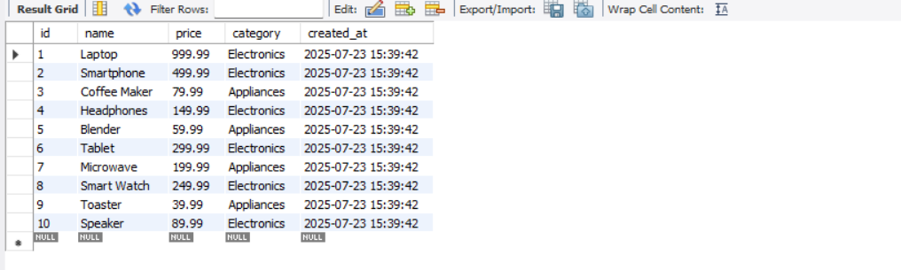
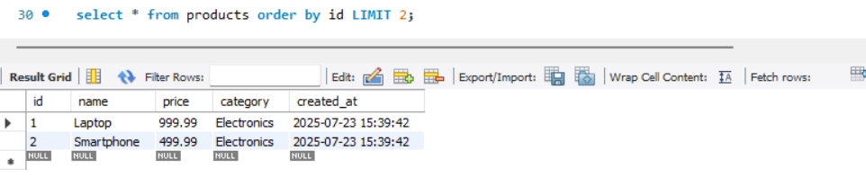
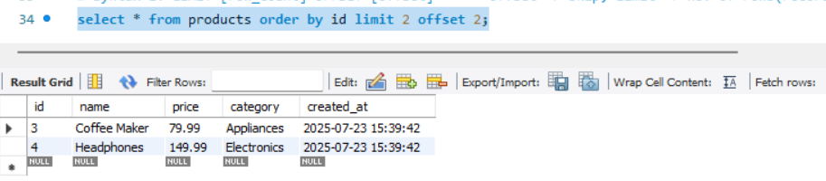
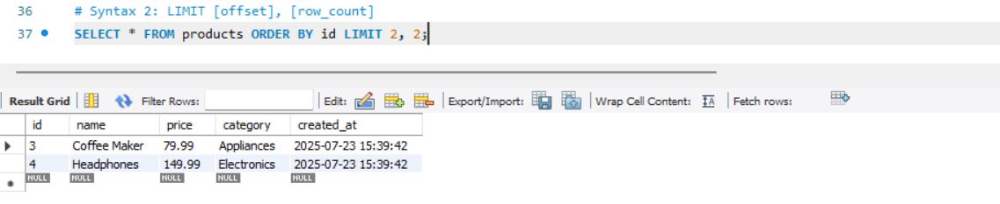
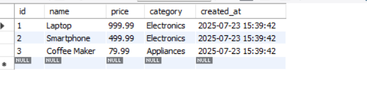
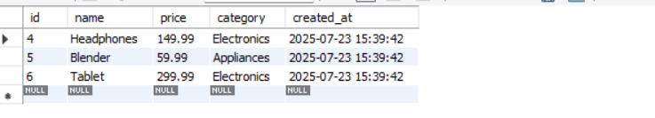
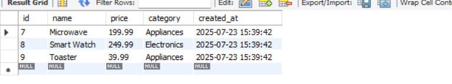
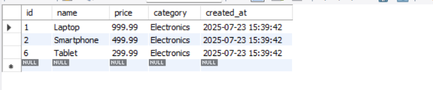
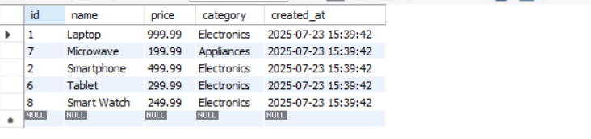
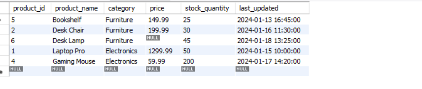

CREATE DATABASE limit_offset_db;
use limit_offset_db;

# Create products table
    CREATE TABLE products (
        id INT AUTO_INCREMENT PRIMARY KEY,
        name VARCHAR(100),
        price DECIMAL(10,2),
        category VARCHAR(50),
        created_at TIMESTAMP DEFAULT CURRENT_TIMESTAMP
);
# Insert sample data
    INSERT INTO products (name, price, category) VALUES
        ('Laptop', 999.99, 'Electronics'),
        ('Smartphone', 499.99, 'Electronics'),
        ('Coffee Maker', 79.99, 'Appliances'),
        ('Headphones', 149.99, 'Electronics'),
        ('Blender', 59.99, 'Appliances'),
        ('Tablet', 299.99, 'Electronics'),
        ('Microwave', 199.99, 'Appliances'),
        ('Smart Watch', 249.99, 'Electronics'),
        ('Toaster', 39.99, 'Appliances'),
        ('Speaker', 89.99, 'Electronics');

# fetch all products 
    select * from products;
  

# Basic LIMIT Usage
# Return first 2 products
    select * from products order by id LIMIT 2;
  

# LIMIT with OFFSET
# Syntax 1: LIMIT [row_count] OFFSET [offset]       offset -> no. of row's skip, limit -> no. of rows to shows(records)
    select * from products order by id limit 2 offset 2
  

# we can also use LIMIT with OFFSET
# Syntax 2: LIMIT [offset], [row_count]
    SELECT * FROM products ORDER BY id LIMIT 2, 2;
  

# Important
# Pagination Implementation
# Page size: 3 items per page
# For page 1 (Using OFFSET syntax):
    SELECT * FROM products LIMIT 3 OFFSET 0;
  
# For page 2:
    SELECT * FROM products LIMIT 3 OFFSET 3;
  
# For page 3:
    SELECT * FROM products LIMIT 3 OFFSET 6;
  

# Alternative syntax using LIMIT offset, count
# For page 1:
    SELECT * FROM products LIMIT 0, 3;
  
# For page 2:
    SELECT * FROM products LIMIT 3, 3;
  
# For page 3:
    SELECT * FROM products LIMIT 6, 3;
  
# Generic formula for pagination:
    # LIMIT (page_number - 1) * items_per_page, items_per_page

# Common Use Cases
# Top 3 most expensive products
    SELECT * FROM products
    ORDER BY price DESC
    LIMIT 3;
  
# Get 5 random products
    SELECT * FROM products
    ORDER BY RAND()
    LIMIT 5;
  
  
  

# Performance Considerations

-- Example of potentially slow query with large offset

    SELECT *
    FROM products  -- Note: In real scenario, this would be a much larger table
    ORDER BY created_at
    LIMIT 1000000, 10;

-- Better alternative using WHERE clause

    SELECT *
    FROM products
    WHERE created_at > '2025-01-01 00:00:00'
    ORDER BY created_at
    LIMIT 10;

-- Key Takeaways

/*
✅ LIMIT helps in retrieving a specific number of rows
✅ LIMIT offset, count is used for pagination
✅ Combining ORDER BY with LIMIT is essential for meaningful result sets
✅ Be cautious about performance impacts when using high offset values
*/
@adil162006
adil162006 commented 2 weeks ago