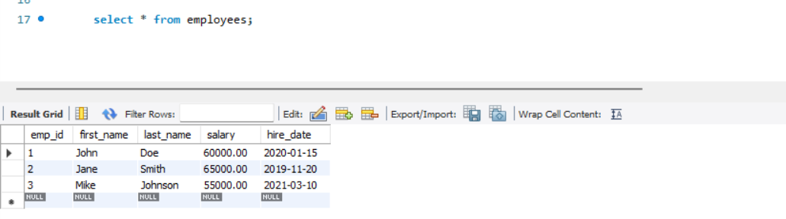
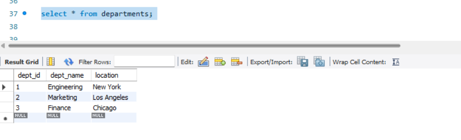
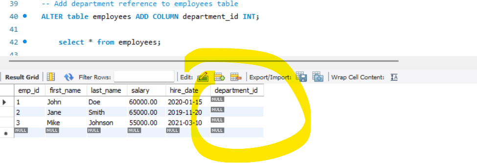
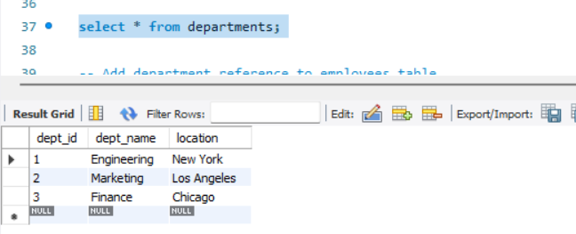
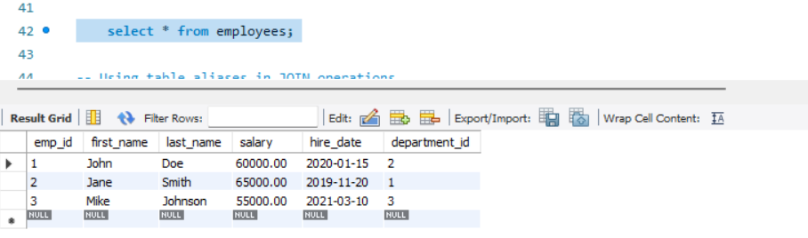
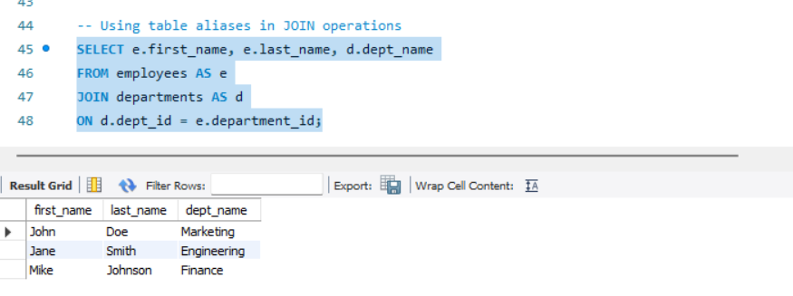
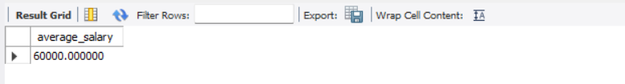

-- Aliases are temporary names assigned to database tables, columns, or expressions
-- to make them more readable and manageable.

-- Create and use the database

    CREATE DATABASE alias_db;
    USE alias_db;

-- Create employees table

    CREATE TABLE employees (
        emp_id INT PRIMARY KEY,
        first_name VARCHAR(50),
        last_name VARCHAR(50),
        salary DECIMAL(10,2),
        hire_date DATE
    );

-- Insert initial employee data

    INSERT INTO employees VALUES
    (1, 'John', 'Doe', 60000.00, '2020-01-15'),
    (2, 'Jane', 'Smith', 65000.00, '2019-11-20'),
    (3, 'Mike', 'Johnson', 55000.00, '2021-03-10');

-- View all employees

    SELECT * FROM employees;

-- Basic column aliases: Creating full name using concatenation

    SELECT
    CONCAT(first_name, " ", last_name) AS full_name
    FROM employees;

-- Create departments table

    CREATE TABLE departments (
        dept_id INT PRIMARY KEY,
        dept_name VARCHAR(50),
        location VARCHAR(50)
    );

-- Insert department data

    INSERT INTO departments VALUES
    (1, 'Engineering', 'New York'),
    (2, 'Marketing', 'Los Angeles'),
    (3, 'Finance', 'Chicago');

-- fetch departments details
  
    select * from departments;

-- Add department reference to employees table 

    ALTER TABLE employees ADD COLUMN department_id INT;

-- Using table aliases in JOIN operations

-- Using table aliases in JOIN operations

    SELECT e.first_name, e.last_name, d.dept_name
    FROM employees AS e
    JOIN departments AS d
    ON d.dept_id = e.department_id;

-- Using aliases in subqueries

    SELECT avg_salary.average_salary
    FROM (
    SELECT AVG(salary) AS average_salary
    FROM employees
    ) AS avg_salary;

