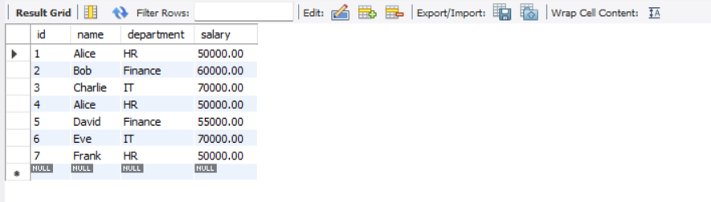
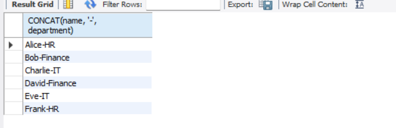
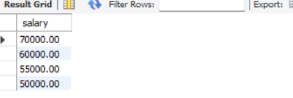
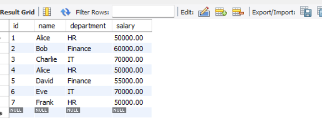
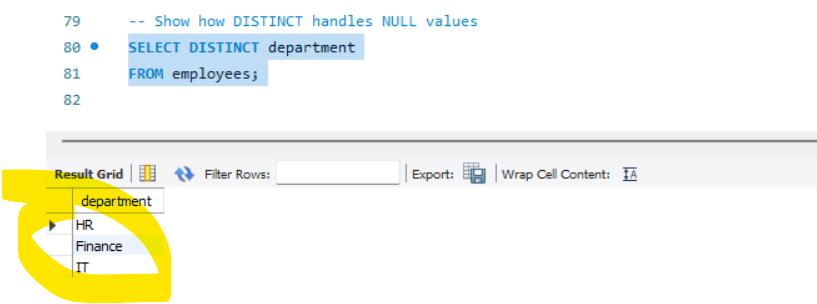
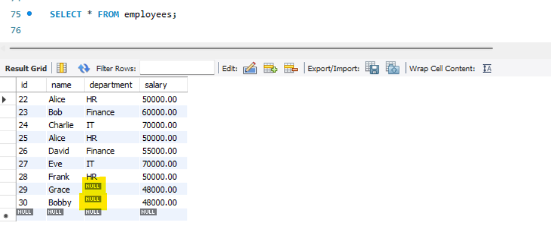
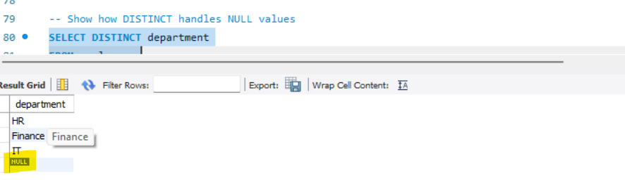

-- MySQL DISTINCT Tutorial
-- The DISTINCT clause eliminates duplicate rows from the result set
-- Syntax: SELECT DISTINCT column1, column2 FROM table_name;

-- Create and use the database

    CREATE DATABASE EmployeeDB;
    USE EmployeeDB;

-- Create employees table

    CREATE TABLE employees (
    id INT AUTO_INCREMENT PRIMARY KEY,
    name VARCHAR(50),
    department VARCHAR(50),
    salary DECIMAL(10,2)
    );

-- Insert sample data including duplicates

    INSERT INTO employees (name, department, salary) VALUES
    ('Alice', 'HR', 50000),
    ('Bob', 'Finance', 60000),
    ('Charlie', 'IT', 70000),
    ('Alice', 'HR', 50000),      -- Duplicate record
    ('David', 'Finance', 55000),
    ('Eve', 'IT', 70000),        -- Duplicate salary
    ('Frank', 'HR', 50000);      -- Duplicate department & salary

-- View all employees

    SELECT * FROM employees;

-- Example 1: Using DISTINCT on a single column
-- Get unique departments

    SELECT DISTINCT department
    FROM employees;

-- Example 2: Using DISTINCT on multiple columns
-- Get unique department-salary combinations

    SELECT DISTINCT department, salary
    FROM employees;

-- Example 3: Using DISTINCT with aggregate functions
-- Count number of unique departments

    SELECT COUNT(DISTINCT department) AS unique_departments
    FROM employees;

-- Example 4: Using DISTINCT with string functions
-- Get unique name-department combinations

    SELECT DISTINCT CONCAT(name, '-', department)
    FROM employees;

-- Example 5: Using DISTINCT with ORDER BY
-- Get unique salaries in descending order

    SELECT DISTINCT salary
    FROM employees
    ORDER BY salary DESC;

-- Example 6: Using DISTINCT with WHERE clause
-- Get unique departments where salary is greater than 50000

    SELECT DISTINCT department
    FROM employees
    WHERE salary > 50000;

-- Display current data

    SELECT * FROM employees;

# without Null Values all distinct department count is 3

    SELECT DISTINCT department
    FROM employees;

-- Example 7: Handling NULL values with DISTINCT
-- Insert records with NULL departments

    INSERT INTO employees (name, department, salary) VALUES
    ('Grace', NULL, 48000),
    ('Bobby', NULL, 48000);

-- Show how DISTINCT handles NULL values
# with Null Values all distinct department count is 3 so, Null also showing as a distinct element but in count it will 3 not 4.

    SELECT DISTINCT department
    FROM employees;

