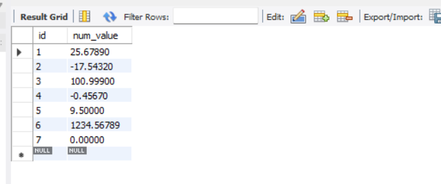
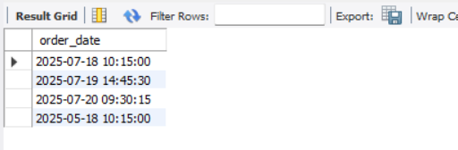

-- =============================================
-- SQL FUNCTIONS DEMO SCRIPT
-- A comprehensive demonstration of various SQL functions
-- =============================================

-- =================
-- STRING FUNCTIONS
-- =================

-- Create and use database for string function examples

    CREATE DATABASE StringFunctionsDB;
    USE StringFunctionsDB;

-- Create employees table for string function demonstrations

    CREATE TABLE employees (
        emp_id INT AUTO_INCREMENT PRIMARY KEY,
        first_name VARCHAR(50),
        last_name VARCHAR(50),
        email VARCHAR(100),
        department VARCHAR(50)
    );

-- Insert sample employee data

    INSERT INTO employees (first_name, last_name, email, department) VALUES
    ('John', 'Doe', 'john.doe@example.com', 'Marketing'),
    ('Jane', 'Smith', 'jane.smith@example.com', 'Sales'),
    ('Michael', 'Johnson', 'michael.johnson@example.com', 'IT'),
    ('Emily', 'Davis', 'emily.davis@example.com', 'HR'),
    ('Chris', 'Brown', 'chris.brown@example.com', 'Finance');

  

# CONCAT: Combine first and last names into full name
    SELECT CONCAT(first_name, ' ', last_name) AS full_name FROM employees;

# LENGTH: Get the length of the first name
    SELECT first_name, LENGTH(first_name) AS name_length FROM employees;

# UPPER and LOWER: Convert first names to uppercase and lowercase
    SELECT first_name, UPPER(first_name) AS uppercase, LOWER(first_name) AS lowercase FROM employees;

# TRIM: Remove leading and trailing spaces
    SELECT TRIM(UPPER('      ok.   ')) AS trimmed_sample;

# SUBSTRING: Extract the first three characters of first names
    SELECT first_name, SUBSTRING(first_name, 1, 3) AS first_three_chars FROM employees;

# LOCATE: Find the position of character 'a' in first names
    SELECT first_name, LOCATE('a', first_name) AS position_of_a FROM employees;

# LOCATE: Find the position of characters 'ch' in first names
    SELECT first_name, LOCATE('ch', first_name) AS position_of_ch FROM employees;

# REPLACE: Replace domain in email addresses
    SELECT first_name, REPLACE(email, 'example.com', 'amazon.com') AS new_email FROM employees;

# REVERSE: Reverse the characters in first names
    SELECT first_name, REVERSE(first_name) AS reversed_name FROM employees;

# LEFT and RIGHT: Get the first two and last two characters of first names
    SELECT first_name,
    LEFT(first_name, 2) AS first_two,
    RIGHT(first_name, 2) AS last_two
    FROM employees;

# ASCII: Get ASCII value of the first character in first names (regular and lowercase)
    SELECT first_name,
    ASCII(first_name) AS ascii_value,
    ASCII(LOWER(first_name)) AS ascii_lowercase_value
    FROM employees;

# LENGTH vs CHAR_LENGTH: Demonstrate difference with ASCII and multibyte characters
    SELECT LENGTH('hello') AS length_in_bytes;          -- Returns 5 (bytes)

    SELECT LENGTH('こんにちは') AS multibyte_length;      -- Returns more than 5 because each character is multiple bytes

    SELECT CHAR_LENGTH('hello') AS char_count;          -- Returns 5 (characters)

    SELECT CHAR_LENGTH('こんにちは') AS multibyte_char_count; -- Returns 5 (characters)

# SOUNDEX: Compare phonetically similar strings
    SELECT SOUNDEX('Smith') AS smith_soundex;  -- Returns 'S530'
    SELECT SOUNDEX('Smyth') AS smyth_soundex;  -- Also returns 'S530'
    SELECT SOUNDEX('Robert') AS robert_soundex; -- Returns 'R163'
    SELECT SOUNDEX('Rupert') AS rupert_soundex; -- Also returns 'R163'

# Find employees with names that sound like "Jane"
    SELECT * FROM employees WHERE SOUNDEX('jane') = SOUNDEX(first_name);

-- =================
# NUMERIC FUNCTIONS
-- =================

    CREATE DATABASE NumericFunctionsDB;
    USE NumericFunctionsDB;

    CREATE TABLE numbers (
        id INT AUTO_INCREMENT PRIMARY KEY,
        num_value DECIMAL(10,5)
    );

    INSERT INTO numbers (num_value) VALUES
    (25.6789),
    (-17.5432),
    (100.999),
    (-0.4567),
    (9.5),
    (1234.56789),
    (0);

# Basic display of all values
    SELECT * FROM numbers;

# Absolute value function
    SELECT num_value, ABS(num_value) AS absolute_value FROM numbers;

# Rounding functions
    SELECT num_value,
    CEIL(num_value) AS rounded_up,
    FLOOR(num_value) AS rounded_down
    FROM numbers;

    SELECT num_value, ROUND(num_value, 2) AS rounded_2_decimals FROM numbers;

    SELECT num_value, TRUNCATE(num_value, 2) AS truncated_2_decimals FROM numbers;

# Mathematical operations
    SELECT num_value, POWER(num_value, 2) AS squared FROM numbers;

    SELECT num_value, MOD(num_value, 3) AS remainder FROM numbers;

    SELECT num_value, SQRT(ABS(num_value)) AS sqrt_value FROM numbers;

# Important
# Exponential functions with handling for out-of-range values
    SELECT
    num_value,
    CASE
    WHEN num_value > 709 THEN 'Value too large for EXP()'
    ELSE EXP(num_value)
    END AS exp_value
    FROM numbers;

# Logarithmic functions

    SELECT num_value,
    LOG(2, ABS(num_value) + 1) AS log_base2,
    LOG10(ABS(num_value) + 1) AS log_base10
    FROM numbers;

# Trigonometric functions
    SELECT num_value,
    SIN(num_value) AS sin_value,
    COS(num_value) AS cos_value,
    TAN(num_value) AS tan_value
    FROM numbers;

# Pi constant and angle conversions
SELECT PI() AS pi_value;

    SELECT num_value,
    RADIANS(num_value) AS radians_value,
    DEGREES(num_value) AS degrees_value
    FROM numbers;

# Bitwise operations
SELECT BIT_AND(num_value) FROM numbers;
SELECT BIT_OR(num_value) FROM numbers;
SELECT BIT_XOR(num_value) FROM numbers;

-- =================
# DATE FUNCTIONS
-- =================

-- Date and time data types:
# DATE	        YYYY-MM-DD           Stores only date without time
# DATETIME      YYYY-MM-DD HH:MI:SS  Stores date and time
# TIMESTAMP     YYYY-MM-DD HH:MI:SS  Stores date/time with automatic UTC conversion
# TIME          HH:MI:SS             Stores only time
# YEAR          YYYY                 Stores only a four-digit year

# Current date and time functions
    SELECT NOW() AS current_datetime;

    SELECT CURDATE() AS current_date;

    SELECT CURTIME() AS current_time;

    SELECT CURRENT_DATE();

    SELECT CURRENT_TIME();

    SELECT CURRENT_TIMESTAMP();

    SELECT CURRENT_USER();

# Date part extraction
    SELECT YEAR(NOW()) AS current_year;

    SELECT MONTH(NOW()) AS current_month;

    SELECT DAY(NOW()) AS current_day;

    SELECT HOUR(NOW()) AS current_hour;

    SELECT MINUTE(NOW()) AS current_minute;

    SELECT SECOND(NOW()) AS current_second;

# Date formatting
    SELECT DATE_FORMAT('2025-03-13', '%W, %M %d, %Y') AS formatted_date_long; -- "Thursday, March 13, 2025"

    SELECT DATE_FORMAT('2025-03-13', '%d/%m/%Y') AS formatted_date_short; -- "13/03/2025"

    select DATE_FORMAT('2025-07-25', '%d/%m/%y') AS formatted_date_short; -- "25/07/25"

# Date arithmetic
    SELECT DATE_ADD('2025-03-13', INTERVAL 7 MONTH) AS date_plus_7_months;

    SELECT DATE_SUB('2025-03-13', INTERVAL 7 MONTH) AS date_minus_7_months;

# Date difference
    SELECT DATEDIFF('2025-03-10', '2024-03-03') AS days_between;

# Unix timestamp functions (seconds since January 1, 1970, at 00:00:00 UTC)
    SELECT UNIX_TIMESTAMP('2025-03-03') AS unix_time;

    SELECT FROM_UNIXTIME(1741392000) AS readable_date;

# Date function examples with a database
    CREATE DATABASE DateExamplesDB;
    USE DateExamplesDB;

    CREATE TABLE orders (
        order_id INT AUTO_INCREMENT PRIMARY KEY,
        customer_name VARCHAR(100),
        order_date DATETIME
    );

    INSERT INTO orders (customer_name, order_date) VALUES
    ('Alice', '2025-07-18 10:15:00'),
    ('Bob', '2025-07-19 14:45:30'),
    ('Charlie', '2025-07-20 09:30:15'),
    ('Akshay', '2024-07-20 10:15:00');

    SELECT * FROM orders;

# Querying orders in the last 7 days

    select date_sub(now(), interval 7 day);
   [img_54.png](img_54.png)

    select customer_name, order_date from orders
    where order_date >= (select date_sub(now(), interval 7 day));

    SELECT * FROM orders WHERE order_date >= DATE_SUB(NOW(), INTERVAL 7 DAY);

# Querying orders in the last 3 months
    INSERT INTO orders (customer_name, order_date) VALUES
        ('andrew', '2025-05-18 10:15:00'),
        ('Mathew', '2025-04-19 14:45:30'),
        ('prince', '2025-02-20 09:30:15'),
        ('alexender', '2024-08-20 10:15:00'),
        ('stefen', '2024-08-20 10:15:00');

    SELECT * FROM orders;

# Querying orders in the last 3 months
    select order_date from orders where order_date >= (select date_sub(now(), interval 3 month));

# Querying orders in the last 1 year
    select order_date from orders where order_date >= (select date_sub(now(), interval 1 year));

-- =================
# AGGREGATE FUNCTIONS
-- =================

-- Used to perform calculations on multiple rows of data and return a single summarized value
# COUNT() – Returns the number of rows
# SUM() – Returns the sum of a numeric column
# AVG() – Returns the average value of a numeric column
# MIN() – Returns the minimum value
# MAX() – Returns the maximum value

    CREATE DATABASE function_CompanyDB2;
    USE function_CompanyDB2;

    CREATE TABLE employees (
        id INT AUTO_INCREMENT PRIMARY KEY,
        name VARCHAR(50),
        department VARCHAR(50),
        salary DECIMAL(10,2),
        hire_date DATE
    );

    INSERT INTO employees (name, department, salary, hire_date) VALUES
    ('Alice', 'HR', 50000, '2018-06-23'),
    ('Bob', 'IT', 70000, '2019-08-01'),
    ('Charlie', 'Finance', 80000, '2017-04-15'),
    ('David', 'HR', 55000, '2020-11-30'),
    ('Eve', 'IT', 75000, '2021-01-25'),
    ('Frank', 'Finance', 72000, '2019-07-10'),
    ('Grace', 'IT', 68000, '2018-09-22'),
    ('Hank', 'Finance', 90000, '2016-12-05'),
    ('Ivy', 'HR', 53000, '2022-03-19'),
    ('Jack', 'IT', 72000, '2017-05-12');

# Count employees in HR department
    SELECT COUNT(*) AS hr_employee_count FROM employees WHERE department='HR';

# Sum of salaries in HR department
    SELECT SUM(salary) AS total_hr_salary FROM employees WHERE department='HR';

# Average salary in HR department
    SELECT AVG(salary) AS avg_hr_salary FROM employees WHERE department='HR';

# Minimum salary in HR department
    SELECT MIN(salary) AS min_hr_salary FROM employees WHERE department='HR';

# Maximum salary in HR department
    SELECT MAX(salary) AS max_hr_salary FROM employees WHERE department='HR';

# Comprehensive statistics for all employees
    SELECT
    COUNT(*) AS num_employees,
    SUM(salary) AS total_salary,
    AVG(salary) AS average_salary,
    MIN(salary) AS lowest_salary,
    MAX(salary) AS highest_salary
    FROM employees;

select * from employees;

    select department,
    count(*) as total_employee,
    sum(salary) as total_salary,
    min(salary) as min_salary,
    avg(salary) as average_salary,
    max(salary) as max_salary
    from employees
    group by (department)
    order by total_salary desc;

# Group by department to get statistics per department
    SELECT
    department,
    COUNT(*) AS employee_count,
    SUM(salary) AS department_total_salary,
    ROUND(AVG(salary), 2) AS department_avg_salary,
    MIN(salary) AS department_min_salary,
    MAX(salary) AS department_max_salary
    FROM employees
    GROUP BY department
    ORDER BY department_avg_salary DESC;
