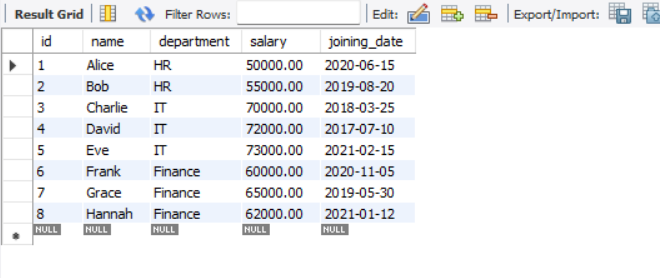

# >> Group By is used to grouping a rows whose value is same in a specified column.
# >> Group By commonly used with Aggregate function like count, min, max, sum, avg

# GROUP BY Examples in SQL
# Database Setup
# =============================================
    CREATE DATABASE group_by_db;
    USE group_by_db;

# Table Creation
# =============================================
    CREATE TABLE employees (
        id INT AUTO_INCREMENT PRIMARY KEY,
        name VARCHAR(50),
        department VARCHAR(50),
        salary DECIMAL(10,2),
        joining_date DATE
    );

# Initial Data Insertion
# =============================================
    INSERT INTO employees (name, department, salary, joining_date) VALUES
    ('Alice', 'HR', 50000, '2020-06-15'),
    ('Bob', 'HR', 55000, '2019-08-20'),
    ('Charlie', 'IT', 70000, '2018-03-25'),
    ('David', 'IT', 72000, '2017-07-10'),
    ('Eve', 'IT', 73000, '2021-02-15'),
    ('Frank', 'Finance', 60000, '2020-11-05'),
    ('Grace', 'Finance', 65000, '2019-05-30'),
    ('Hannah', 'Finance', 62000, '2021-01-12');

    select * from employees;

# Additional Data Insertion
# =============================================
    INSERT INTO employees (name, department, salary, joining_date) VALUES
    ('Tim', 'HR', 65000, '2019-05-30'),
    ('Tom', 'IT', 62000, '2021-01-12');

    select * from employees;

# Example 1: Count Employees in Each Department
    SELECT department, COUNT(*) AS Employee_Count
    FROM employees
    GROUP BY department;

# Example 2: Get the Average Salary Per Department
    SELECT department, AVG(salary) AS Average_Salary
    FROM employees
    GROUP BY department;

# Example 3: Get the Highest and Lowest Salary Per Department
    SELECT department, MIN(salary) AS lowest_salary, MAX(salary) AS highest_salary
    FROM employees
    GROUP BY department;

# Example 4: Count Employees Per Department and Joining Year
    SELECT department, YEAR(joining_date) AS joining_year, COUNT(*) AS employee_count
    FROM employees
    GROUP BY joining_year, department;

# Example 5: Order Departments by the Highest Average Salary
    SELECT department, AVG(salary) AS avg_salary
    FROM employees
    GROUP BY department
    ORDER BY avg_salary DESC;

    SELECT department, AVG(salary) AS avg_salary
    FROM employees
    GROUP BY department
    ORDER BY avg_salary DESC LIMIT 1;

# Example 6: Group by Calculated Salary Range
    select count(*),
        case
            when salary <= 60000 then 'minimum salaried employees'
            when salary >= 60000 and salary <= 70000 then 'average salaried employees'
            when salary >= 60000 then 'maximum salaried employees'
        end as salaried_range
    FROM employees
    group by salaried_range;

    SELECT
        CASE
            WHEN salary < 60000 THEN 'Low Salary'
            WHEN salary BETWEEN 60000 AND 70000 THEN 'Medium Salary'
            ELSE 'High Salary'
        END AS salary_range,
    COUNT(*) AS employee_count
    FROM employees
    GROUP BY salary_range;

# Example 7: Find Department with the Maximum Number of Employees
    SELECT department, COUNT(*) AS total_employees
    FROM employees
    GROUP BY department
    ORDER BY total_employees DESC
    LIMIT 1;

    
    SELECT department, COUNT(*) AS total_employees
    FROM employees
    GROUP BY department
    ORDER BY total_employees DESC;

# Example 8: Find Departments With More Than 2 Employees (With Conditions)
    SELECT department, COUNT(*) AS total_employees
    FROM employees
    GROUP BY department
    HAVING total_employees > 2;

    
    SELECT
    department,
    AVG(salary) AS average_salary,
    COUNT(*) AS total_employees
    FROM employees
    WHERE joining_date > '2017-07-10'
    GROUP BY department
    HAVING total_employees > 2 AND average_salary > 55000;
