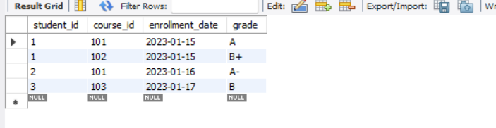
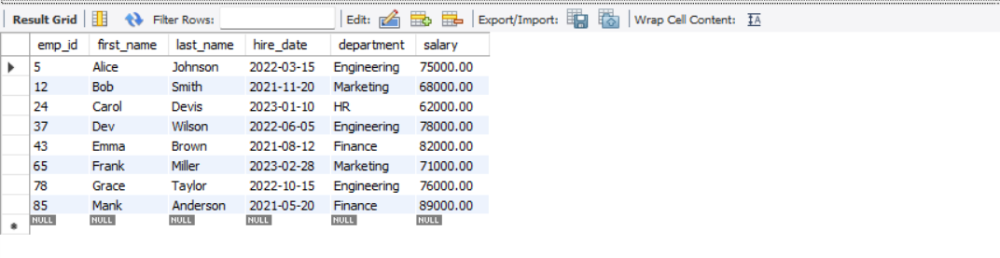
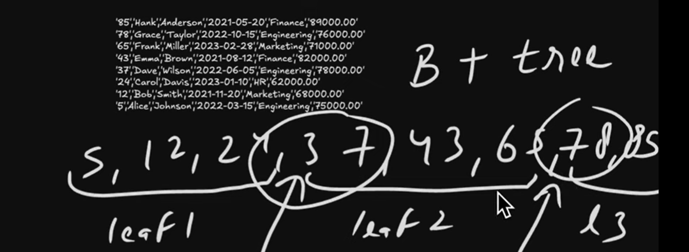
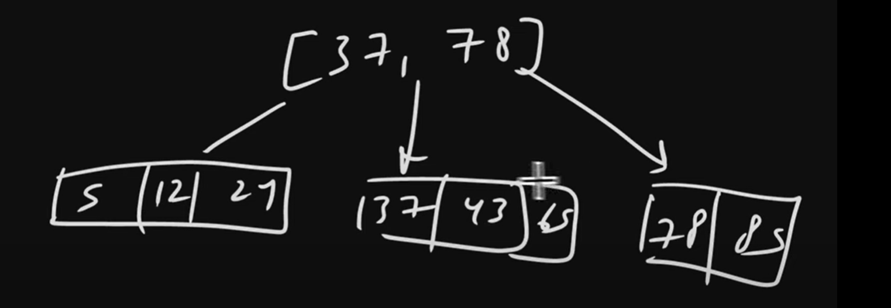
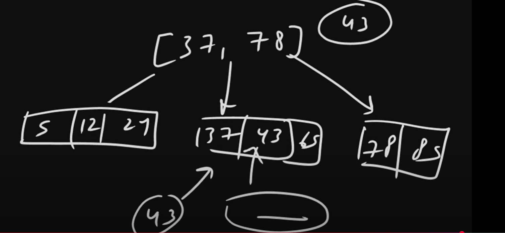

# Primary Key Uniquely Identified in each and every row inside a Table.

# Primary Keys - Key Benefits:
    1. They uniquely identify each record in a table, 2 rows should not be same in corresponding of a pk column.

    2. They ensure no duplicate records exist

    3. That fields can not be bull.

    4. They provide a reference point for relationships between tables.

    5. They optimize database performance for record retrieval

    6. PK should be stable it should not like we are changing repeatedly.

# SECTION 1: Basic Primary Key Implementation
# Creating a table with a simple primary key
    CREATE TABLE students (
        student_id INT PRIMARY KEY,
        first_name VARCHAR(50) NOT NULL,
        last_name VARCHAR(50) NOT NULL,
        email VARCHAR(100)
    );

** We have created student_id as a Primary_KEY bcz using student_id i want to uniquely identify each row in a student table.
** It ensures the same student_id student should not store.
** This student_id PK will be a reference to a relationship between multiple tables.
** We can do faster retrieval with the help of student_id primary key.
** 

# Inserting records with valid primary keys
    INSERT INTO students (student_id, first_name, last_name, email)
    VALUES
    (1, 'John', 'Smith', 'john.smith@example.com'),
    (2, 'Maria', 'Garcia', 'maria.garcia@example.com'),
    (3, 'Ahmed', 'Khan', 'ahmed.khan@example.com');

select * from students;

# Demonstrating primary key constraint - This will fail
    INSERT INTO students (student_id, first_name, last_name, email)
    VALUES (1, 'Jane', 'Doe', 'jane.doe@example.com');
    -- Error Code: 1062. Duplicate entry '1' for key 'PRIMARY'

** generally which column we make a primary key that column data we won't store manually we generally keep that column
   as an Auto-Increment. which mean id will automatically increment and store.

# SECTION 2: Auto-increment Primary Keys
# Creating a table with an auto-increment primary key
      CREATE TABLE products (
         product_id INT AUTO_INCREMENT PRIMARY KEY,
         product_name VARCHAR(100) NOT NULL,
         price DECIMAL(10, 2) NOT NULL,
         description TEXT
      );

# With auto-increment, we don't need to specify the primary key value
      INSERT INTO products (product_name, price, description)
      VALUES
      ('Laptop', 1299.99, 'High-performance laptop'),
      ('Smartphone', 799.99, 'Latest model smartphone'),
      ('Headphones', 199.99, 'Noise-cancelling headphones');

# View the auto-generated IDs
      SELECT * FROM products;

# SECTION 3: Adding Primary Keys to Existing Tables
# Creating a table with a primary key defined separately
      CREATE TABLE orders (
         order_id INT,
         customer_id INT,
         order_date DATE NOT NULL,
         total_amount DECIMAL(10, 2) NOT NULL,
         PRIMARY KEY (order_id)
      );

# Create table without primary key
      CREATE TABLE suppliers (
         supplier_id INT,
         supplier_name VARCHAR(100) NOT NULL,
         contact_person VARCHAR(100)
      );

# Adding a primary key to an existing table
      ALTER TABLE suppliers
      ADD PRIMARY KEY (supplier_id);

** Earlier we saw In every table only one column is a Primary Key. But It may happen in our table 2 or more than 2
   columns uniquely identified a row. In that case we will create a Primary Key using multiple columns which we call 
   Composite Primary Key. 

** so, we are going to create a Primary key using student_id and course_id, which mean their combinations(student_id & course_id)
   uniquely identified each & every row.

** Always Remember student_id is not uniquely identified and same for course_id also not uniquely identified but their combinations(student_id & course_id)
   uniquely identified each & every row.

** Because A Student can enroll in a multiple course and A course can be enrolled by a multiple students. So, here unique thing will
   be a combination of (student_id & course_id).

# SECTION 4: Composite Primary Keys
# Creating a table with a composite primary key (multiple columns)
      CREATE TABLE enrollments (
         student_id INT,
         course_id INT,
         enrollment_date DATE NOT NULL,
         grade VARCHAR(2),
         PRIMARY KEY (student_id, course_id)
      );

# Insert records with unique combinations of the composite key
      INSERT INTO enrollments (student_id, course_id, enrollment_date, grade)
      VALUES
      (1, 101, '2023-01-15', 'A'),
      (1, 102, '2023-01-15', 'B+'),  -- Same student, different course - OK
      (2, 101, '2023-01-16', 'A-'),  -- Different student, same course - OK
      (3, 103, '2023-01-17', 'B');

# This will fail - duplicate composite key (student_id + course_id)
      INSERT INTO enrollments (student_id, course_id, enrollment_date, grade)
      VALUES (1, 101, '2023-02-01', 'C');
      -- Error: Duplicate entry '1-101' for key 'PRIMARY'

      select * from enrollments;

# This will fail - duplicate composite key (student_id + course_id)
      INSERT INTO enrollments (student_id, course_id, enrollment_date, grade)
      VALUES (1, 101, '2023-02-01', 'C');
      -- Error: Duplicate entry '1-101' for key 'PRIMARY'

# Primary Key Best Practices:
# 1. Always include a primary key in every table
# 2. Use auto-increment unless you have a specific reason not to
# 3. Keep primary keys simple - use INT or BIGINT for numeric IDs

## BEST PRACTICES ##

      ** In Every Table, you should insert a Primary key so every row we can uniquely identify.

      ** Your Query will become FAST, it will be easy to UPDATE & DELETE a Specific ROW If you were using a PRIMARY KEY.

      ** Use auto-increment unless you have a specific reason not to.

      ** Keep primary keys simple - use INT or BIGINT(In case more data will be there) for numeric IDs.

How Primary Key Work Internally ??
==================================

#* When We Create a Primary Key In MySQL, The Database Engine Implements it as a Special Type of Index called Clustered Index.

#* As we know when we create a Primary Key of a column, then along that column Indexing will be created. 

#* 2 types of Indexing - Clustered Index & Non-Clustered Index.

#* When we create a Primary Key, Clustered Index will create Unlike Regular Indexes where Non-Clustered Index will be created.

#* So, Here Indexing happening but the main thing is here Clustered Index will be created.

#* If there is any column that is not Primary Key and Indexing happening, then Non-Clustered Index will be created.

      # CLUSTERED Index Is LIKE a Dictionary, where Actual Data, Based on Actual data it stored.
        Which mean Data is stored based on a Primary Key.

      # NON-CLUSTERED Index Suppose we have a Book. In a Book Table of Content like chapters or at end of Books there
        will be Index which is Non-Clustered Index. Because, here In a Separate Page Information will be there. like this
        content on that page and that contenet on that page so, this is non-clustered Indexed.

#* Clustered Index is a Dictionary which means the Keys and Values words have been stored. Which mean first A will come then B...
   Like a Book In a Book Pages are stored in a Clustered Indexed. Because they are in a page number ordered. 
      But At the End of Book The Index is there that is a Regular Indexed. So, Page Number is a Primary Key but at the end the
      index is there that is a Regular Index so that will be store on a separate page or separate memory location.

#* You will get only one Clustered Indexed per table, which is obvious you will have only one Primary Key Per Table.

#* Inside a Table If you have a Primary key then the Actual data inside that Table, which will be physically stored based on
   that Primary key. we said Physically based on that Primary key means That Data Structure which is using in this case is
   B - Tree. suppose we have an Employee Table so, Internally Table will be store like the below structure.

   

      create database cluster_index;
      use cluster_index;

      CREATE TABLE employees (
         emp_id INT PRIMARY KEY,
         first_name VARCHAR(50),
         last_name VARCHAR(50),
         hire_date DATE,
         department VARCHAR(50),
         salary DECIMAL(10, 2)
      );

      INSERT INTO employees (emp_id, first_name, last_name, hire_date, department, salary) 
      VALUES
      (5, 'Alice', 'Johnson', '2022-03-15', 'Engineering', 75000.00),
      (12, 'Bob', 'Smith', '2021-11-20', 'Marketing', 68000.00),
      (24, 'Carol', 'Devis', '2023-01-10', 'HR', 62000.00),
      (37, 'Dev', 'Wilson', '2022-06-05', 'Engineering', 78000.00),
      (43, 'Emma', 'Brown', '2021-08-12', 'Finance', 82000.00),
      (65, 'Frank', 'Miller', '2023-02-28', 'Marketing', 71000.00),
      (78, 'Grace', 'Taylor', '2022-10-15', 'Engineering', 76000.00),
      (85, 'Mank', 'Anderson', '2021-05-20', 'Finance', 89000.00);

      select * from employees;

   # we are going to see a B-Tree Corresponding of this Table.

   
   
   More Specifically, MySQL Uses B+ tree Mechanism.
   
   The Difference between BTree and B+ Tree is Leaf Nodes will be linked in a B+ Tree as Linked List.
   Here we have to find a Separator, there are multiple factors suppose we want to divide in three groups. 
   8–> 3 Groups.
   
   
   In the B+Tree Actual data will be stored in a Leaf Nodes. And the Root nodes or Middle nodes have Pointers.
   
   
   Here separator is 37 & 78. theses 2 points separate our these numbers into 3 groups. So what my SQL will do from a right side
   group takes the first elements. 
   
   
   So, our Root Nodes will be [ 37, 78 ]
   
   
   If More data comes, then this is a self-balanced Trees.
   
   ** So, No Internal Nodes here.
   ** Root Nodes only Store Keys and Pointers.
   ** Actual Data will be stored in a Leaf - Nodes.

      suppose we are searching for a Employee whose Id is - 43.
      - Is 43 Less than 37 ? No. so we will not go left side Leaf Node.
      - Is 43 Greater than 78 ? No. so we will not go Right side Leaf Node.
      - Which mean 43 Lies on Middle Leaf Node Pointer, so we will go to Middle Leaf Node 
        and we will do a Binary - Search then we will get a Particular Employee Data.

   
   
This is the Simple Explanation/Overview How Primary Key Works Internally.

In Each & Every Query WIll Mysql go to DB mean in a Disk?
------------------------------------------------------

For Each Operation No. There is a Memory called Buffered Pool.
What MySQL will do It Maintain Buffer Pool. Frequently Accessed Things MySQL stored into it.
Frequently access things mean a Page.

Page Concept
------------
There is a concept behind a page. 
So, the Nodes which is in a grouped like we saw in B+tree.
These groups will be stored into a Page.
So, Frequently Accessed page MySQL will cache. 
Page is just like a Container for a B Tree Nodes either Root Nodes, Leaf Nodes or Middle Nodes.
In A Root Nodes Key & Value with a Range, and a Pointers is stored.
A Page size default value will be a 16 KB.
