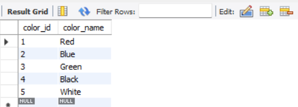
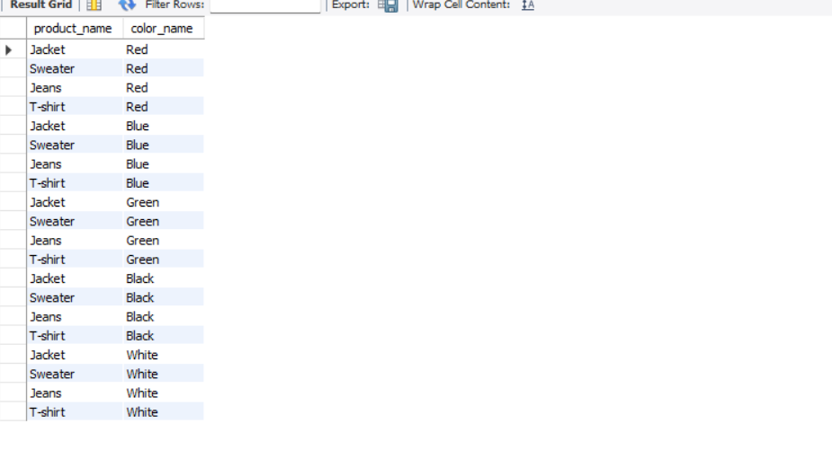

# CROSS JOIN
# Cartesian product of two tables
# It combines each row from the first table with every row from the second table
# resulting in all possible combinations of rows

    CREATE DATABASE cross_join_tutorial;
    USE cross_join_tutorial;
    CREATE TABLE products (
    product_id INT PRIMARY KEY,
    product_name VARCHAR(50) NOT NULL
    );

    CREATE TABLE colors (
    color_id INT PRIMARY KEY,
    color_name VARCHAR(30) NOT NULL
    );

    INSERT INTO products (product_id, product_name) VALUES
    (1, 'T-shirt'),
    (2, 'Jeans'),
    (3, 'Sweater'),
    (4, 'Jacket');

    INSERT INTO colors (color_id, color_name) VALUES
    (1, 'Red'),
    (2, 'Blue'),
    (3, 'Green'),
    (4, 'Black'),
    (5, 'White');

    select * from products;

    select * from colors;

    select p.product_name, c.color_name from products p cross join colors c;

    CREATE TABLE sizes (
    size_id INT PRIMARY KEY,
    size_name VARCHAR(10) NOT NULL
    );

    INSERT INTO sizes (size_id, size_name) VALUES
    (1, 'S'),
    (2, 'M'),
    (3, 'L'),
    (4, 'XL');

    select * from sizes;

# 5 * 4 * 4 = 80
# Generate all possible product variations
    explain select p.product_name, c.color_name, s.size_name, CONCAT(p.product_name, ' - ', c.color_name, ' - Size ', s.size_name) AS full_product_description from products p
    cross join colors c
    cross join sizes s
    where p.product_name='T-shirt';

