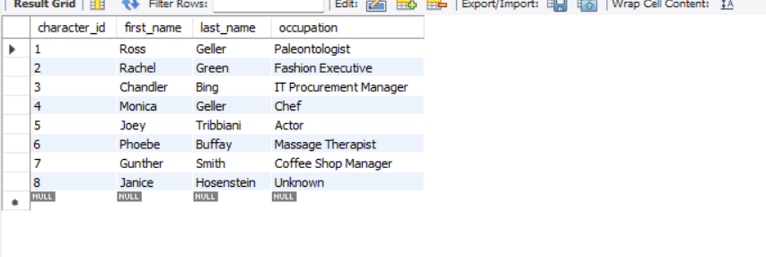

-- ====================================================================
# MySQL FULL JOIN Lecture - Complete SQL Script
-- ====================================================================

# Introduction to FULL JOIN
-- ====================================================================
# FULL JOIN
# It returns all matching rows from both tables where the join condition is met
# It also returns all non-matching rows from the left table (with NULL values for columns from the right table)
# It also returns all non-matching rows from the right table (with NULL values for columns from the left table)
# It combines the results of both LEFT JOIN and RIGHT JOIN, including all records from both tables and matching records from both sides where available.

# Note: MySQL does not natively support FULL JOIN, but we can emulate it using UNION of LEFT JOIN and RIGHT JOIN

# Join Types Comparison:
# INNER JOIN (only returns matching rows between tables)
# LEFT JOIN (returns all rows from left table and matching from right)
# RIGHT JOIN (returns all rows from right table and matching from left)
# FULL JOIN (returns all rows from both tables)

# Database Setup - Friends Theme
# ====================================================================
    CREATE DATABASE full_join_db;
    USE full_join_db;

# Create tables for our demonstration
    CREATE TABLE characters (
        character_id INT PRIMARY KEY,
        first_name VARCHAR(50) NOT NULL,
        last_name VARCHAR(50) NOT NULL,
        occupation VARCHAR(100)
    );

    CREATE TABLE apartments (
        apartment_id INT PRIMARY KEY,
        building_address VARCHAR(100) NOT NULL,
        apartment_number VARCHAR(10) NOT NULL,
        monthly_rent DECIMAL(8, 2),
        current_tenant_id INT
    );

# Sample Data
# ====================================================================
# Insert data into characters
    INSERT INTO characters (character_id, first_name, last_name, occupation) VALUES
    (1, 'Ross', 'Geller', 'Paleontologist'),
    (2, 'Rachel', 'Green', 'Fashion Executive'),
    (3, 'Chandler', 'Bing', 'IT Procurement Manager'),
    (4, 'Monica', 'Geller', 'Chef'),
    (5, 'Joey', 'Tribbiani', 'Actor'),
    (6, 'Phoebe', 'Buffay', 'Massage Therapist'),
    (7, 'Gunther', 'Smith', 'Coffee Shop Manager'),
    (8, 'Janice', 'Hosenstein', 'Unknown');

# Insert data into apartments
    INSERT INTO apartments (apartment_id, building_address, apartment_number, monthly_rent, current_tenant_id) VALUES
    (101, '90 Bedford Street', '20', 3500.00, 3),
    (102, '90 Bedford Street', '19', 3500.00, 4),
    (103, '5 Morton Street', '14', 2800.00, 6),
    (104, '17 Grove Street', '3B', 2200.00, NULL),
    (105, '15 Yemen Road', 'Yemen', 900.00, NULL),
    (106, '495 Grove Street', '7', 2400.00, 1);

# View table data
# ====================================================================
    SELECT * FROM characters;

    SELECT * FROM apartments;

#  JOIN Examples
# ====================================================================

# INNER JOIN Example
# Only returns characters who have apartments and apartments that have tenants
    SELECT c.character_id, c.first_name, c.last_name, c.occupation,
    a.apartment_id, a.building_address, a.apartment_number, a.monthly_rent
    FROM characters c
    INNER JOIN apartments a ON c.character_id = a.current_tenant_id;

# LEFT JOIN Example
# All characters, including those without apartments
    SELECT c.character_id, c.first_name, c.last_name, c.occupation,
    a.apartment_id, a.building_address, a.apartment_number, a.monthly_rent
    FROM characters c
    LEFT JOIN apartments a ON c.character_id = a.current_tenant_id;

# RIGHT JOIN Example
# All apartments, including those without tenants
    SELECT c.character_id, c.first_name, c.last_name, c.occupation,
    a.apartment_id, a.building_address, a.apartment_number, a.monthly_rent
    FROM characters c
    RIGHT JOIN apartments a ON c.character_id = a.current_tenant_id;

# FULL JOIN Example (MySQL implementation using UNION)
# All characters and all apartments, with matches where they exist

    SELECT c.character_id, c.first_name, c.last_name, c.occupation,
    a.apartment_id, a.building_address, a.apartment_number, a.monthly_rent
    FROM characters c
    LEFT JOIN apartments a ON c.character_id = a.current_tenant_id
    UNION
    SELECT c.character_id, c.first_name, c.last_name, c.occupation,
    a.apartment_id, a.building_address, a.apartment_number, a.monthly_rent
    FROM characters c
    RIGHT JOIN apartments a ON c.character_id = a.current_tenant_id;

# PostgreSQL native FULL JOIN syntax (for reference)
/*
    SELECT c.character_id, c.first_name, c.last_name, c.occupation,
    a.apartment_id, a.building_address, a.apartment_number, a.monthly_rent
    FROM characters c
    FULL JOIN apartments a ON c.character_id = a.current_tenant_id;
*/

# Additional examples - Employee/Department context
# ====================================================================
# For a typical HR database scenario, we would use:

# Create Employee/Department tables (commented out)

    CREATE TABLE departments (
    department_id INT PRIMARY KEY,
    department_name VARCHAR(100) NOT NULL,
    location VARCHAR(100)
    );

    CREATE TABLE employees (
    employee_id INT PRIMARY KEY,
    first_name VARCHAR(50) NOT NULL,
    last_name VARCHAR(50) NOT NULL,
    department_id INT,
    salary DECIMAL(10, 2),
    hire_date DATE
    );

# FULL JOIN example for employee/department context
    SELECT e.employee_id, e.first_name, e.last_name,
    d.department_id, d.department_name, d.location
    FROM employees e
    LEFT JOIN departments d ON e.department_id = d.department_id
    UNION
    SELECT e.employee_id, e.first_name, e.last_name,
    d.department_id, d.department_name, d.location
    FROM employees e
    RIGHT JOIN departments d ON e.department_id = d.department_id;

-- Full Join Filtering Examples
-- ====================================================================

# Finding only characters without apartments
    SELECT c.character_id, c.first_name, c.last_name
    FROM characters c
    LEFT JOIN apartments a ON c.character_id = a.current_tenant_id
    WHERE a.apartment_id IS NULL;

# Finding only apartments without tenants
    SELECT a.apartment_id, a.building_address, a.apartment_number
    FROM apartments a
    LEFT JOIN characters c ON a.current_tenant_id = c.character_id
    WHERE c.character_id IS NULL;

# Using the FULL JOIN result to find both unmatched cases
    SELECT c.character_id, c.first_name, c.last_name,
    a.apartment_id, a.building_address, a.apartment_number
    FROM characters c
    LEFT JOIN apartments a ON c.character_id = a.current_tenant_id
    WHERE a.apartment_id IS NULL
    UNION
    SELECT c.character_id, c.first_name, c.last_name,
    a.apartment_id, a.building_address, a.apartment_number
    FROM characters c
    RIGHT JOIN apartments a ON c.character_id = a.current_tenant_id
    WHERE c.character_id IS NULL;
