# An INNER JOIN returns only the rows where there is a match in both tables based on the specified join condition.
# If there's no match, the rows from both tables are excluded from the result set.

# Create database
    CREATE DATABASE inner_join_db;
    USE inner_join_db;

# Create authors table
    CREATE TABLE authors (
        author_id INT PRIMARY KEY,
        first_name VARCHAR(50),
        last_name VARCHAR(50),
        birth_year INT
    );

# Create books table
    CREATE TABLE books (
        book_id INT PRIMARY KEY,
        title VARCHAR(100),
        author_id INT,
        publication_year INT,
        price DECIMAL(6,2)
    );

# Insert data into authors table
    INSERT INTO authors (author_id, first_name, last_name, birth_year)
    VALUES
    (1, 'Jane', 'Austen', 1775),
    (2, 'George', 'Orwell', 1903),
    (3, 'Ernest', 'Hemingway', 1899),
    (4, 'Agatha', 'Christie', 1890),
    (5, 'J.K.', 'Rowling', 1965);

# Insert data into books table
    INSERT INTO books (book_id, title, author_id, publication_year, price)
    VALUES
    (101, 'Pride and Prejudice', 1, 1813, 12.99),
    (102, '1984', 2, 1949, 14.50),
    (103, 'Animal Farm', 2, 1945, 11.75),
    (104, 'The Old Man and the Sea', 3, 1952, 10.99),
    (105, 'Murder on the Orient Express', 4, 1934, 13.25),
    (106, 'Death on the Nile', 4, 1937, 12.50),
    (107, 'Emma', 1, 1815, 11.99),
    (108, 'For Whom the Bell Tolls', 3, 1940, 15.75);

# Display table contents
    SELECT * FROM authors;
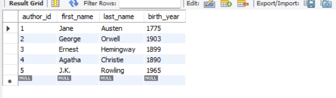

    SELECT * FROM books;
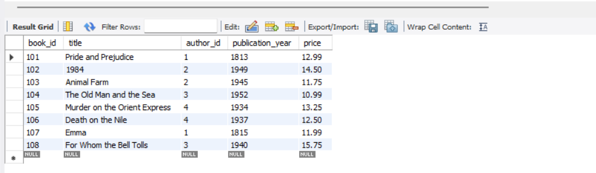

# Basic INNER JOIN syntax:
    /*
    SELECT columns
    FROM table1
    JOIN_TYPE table2
    ON table1.column = table2.column;
    */

# Retrieve books with their author's information
    select *
    FROM books b
    JOIN authors a
    ON b.author_id = a.author_id;
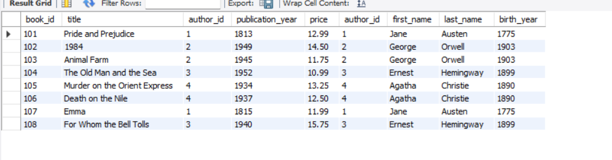

# Find books with their author's where publication year is greater than 1940
    select b.title, b.publication_year, concat(first_name, ' ', last_name) AS 'Author Name'
    FROM books b
    JOIN authors a
    ON b.author_id = a.author_id
    where b.publication_year >= 1940;
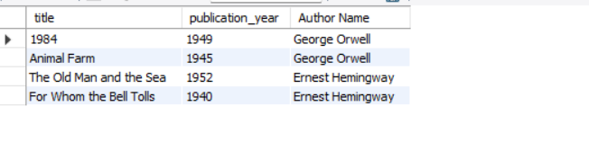

# Find books where publication year is greater than 1940 and written by young Authors
    select b.title, b.publication_year, birth_year,concat(first_name, ' ', last_name) AS 'Author Name'
    FROM books b
    JOIN authors a
    ON b.author_id = a.author_id
    where b.publication_year >= 1940
    order by a.birth_year ASC;
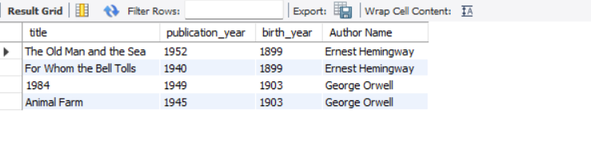

# How many Books Each Authors has written
    SELECT a.first_name, a.last_name, count(*)
    FROM books b
    JOIN authors a
    ON a.author_id = b.author_id
    GROUP BY a.author_id;

    SELECT concat(first_name,' ',last_name) as author_name, count(*)
    FROM books b
    JOIN authors a
    ON a.author_id = b.author_id
    GROUP BY author_name;

# Create categories table for many-to-many relationship example
    CREATE TABLE categories (
    category_id INT PRIMARY KEY,
    category_name VARCHAR(50)
    );

    INSERT INTO categories (category_id, category_name)
    VALUES
    (1, 'Fiction'),
    (2, 'Classic'),
    (3, 'Romance'),
    (4, 'Political'),
    (5, 'Mystery'),
    (6, 'Adventure');

    select * from categories;
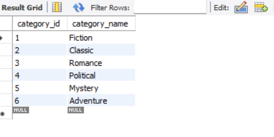

# Create junction table for book-category many-to-many relationship
    CREATE TABLE book_categories (
    book_id INT,
    category_id INT,
    PRIMARY KEY (book_id, category_id)
    );

    INSERT INTO book_categories (book_id, category_id)
    VALUES
    (101, 1), (101, 2), (101, 3), -- Pride and Prejudice: Fiction, Classic, Romance
    (102, 1), (102, 2), (102, 4), -- 1984: Fiction, Classic, Political
    (103, 1), (103, 2), (103, 4), -- Animal Farm: Fiction, Classic, Political
    (104, 1), (104, 2), (104, 6), -- The Old Man and the Sea: Fiction, Classic, Adventure
    (105, 1), (105, 5), -- Murder on the Orient Express: Fiction, Mystery
    (106, 1), (106, 5), -- Death on the Nile: Fiction, Mystery
    (107, 1), (107, 2), (107, 3), -- Emma: Fiction, Classic, Romance
    (108, 1), (108, 2), (108, 6); -- For Whom the Bell Tolls: Fiction, Classic, Adventure

    select * from book_categories;
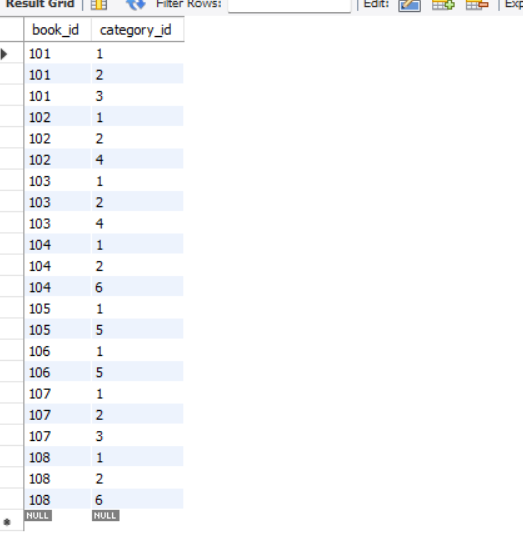

#### Now we have total 4 Table which we need to JOIN (books, authors, categories, book_categories)
# Get Books with their Authors and Theirs Categories
    SELECT bc.category_id, b.book_id, b.title, a.first_name, a.last_name, c.category_name
    FROM books b
    JOIN authors a ON b.author_id = a.author_id
    JOIN book_categories bc ON bc.book_id = b.book_id
    JOIN categories c ON c.category_id = bc.category_id;
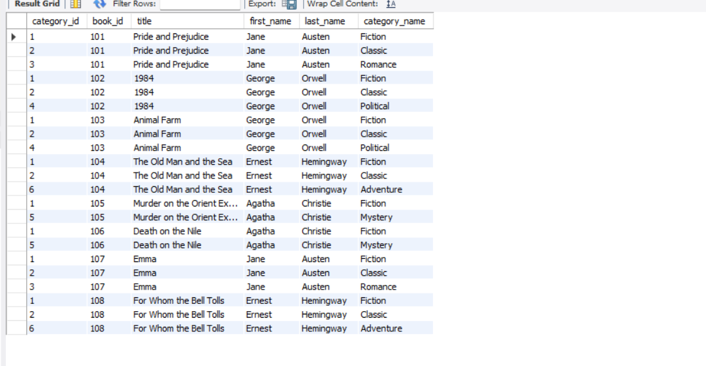

# Get Books with their Authors and Theirs Categories
    SELECT b.book_id, b.title, a.first_name, a.last_name,
    group_concat(c.category_name SEPARATOR ' , ') AS Categories
    FROM books b
    JOIN authors a ON b.author_id = a.author_id
    JOIN book_categories bc ON bc.book_id = b.book_id
    JOIN categories c ON c.category_id = bc.category_id
    GROUP BY b.book_id;
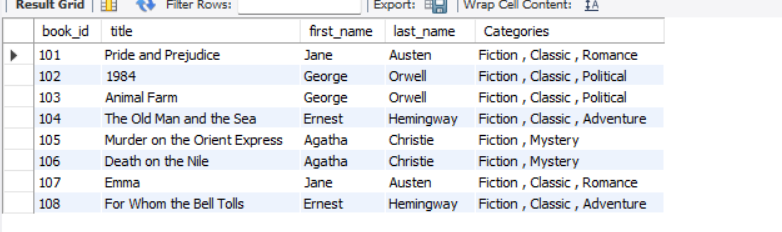

# Example with join condition in ON clause
    SELECT b.title, a.last_name
    FROM books b
    INNER JOIN authors a ON b.author_id = a.author_id
    AND b.publication_year < 1950
    AND a.birth_year < 1900;
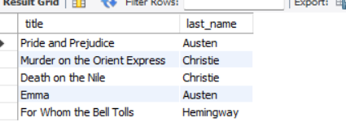

# Equivalent example with join condition in WHERE clause
    SELECT b.title, a.last_name
    FROM books b
    INNER JOIN authors a ON b.author_id = a.author_id
    WHERE b.publication_year < 1950
    AND a.birth_year < 1900;
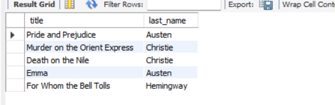

# Example with date functions - books published more than 80 years ago
# books published more than 70 years ago
    select b.title, b.publication_year, a.first_name, a.last_name
    from books b
    JOIN authors a
    ON a.author_id = b.author_id
    WHERE (YEAR(CURDATE()) - b.publication_year) > 90; 
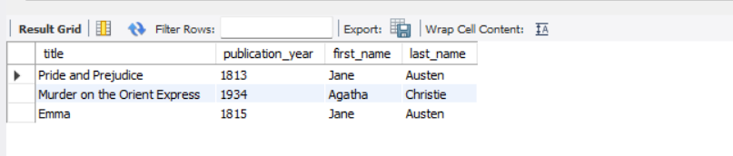

/*
Note: INNER JOIN excludes rows with NULL values in the join columns. If you want to include rows with NULL values,
you would need to use LEFT JOIN or RIGHT JOIN (which we'll cover in later sections).
*/

# Find authors who have written more than one book using HAVING clause
    SELECT a.first_name,
    a.last_name,
    COUNT(b.book_id) AS book_count
    FROM authors a
    INNER JOIN books b ON a.author_id = b.author_id
    GROUP BY a.author_id, a.first_name, a.last_name
    HAVING COUNT(b.book_id) > 1;
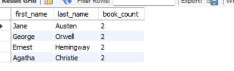

    select a.author_id, CONCAT(first_name, ' ', last_name) AS 'Author Name', COUNT(b.book_id) AS 'Book Count'
    FROM books b
    JOIN authors a
    ON b.author_id = a.author_id
    GROUP BY a.author_id
    HAVING COUNT(b.book_id) > 1;
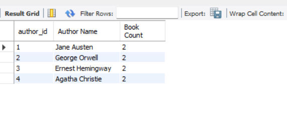

