-- LEFT JOIN (LEFT OUTER JOIN) Tutorial
-- It returns ALL records from the left table and only the matching records from the right table.
-- If no match exists in the right table, NULL values will be returned for the right table's columns.

-- Basic LEFT JOIN syntax

    SELECT columns
    FROM table1
    LEFT JOIN table2
    ON table1.column = table2.column;

-- Create and set up database

    CREATE DATABASE left_join_db;
    USE left_join_db;

-- Create customers table

    CREATE TABLE customers (
    customer_id INT PRIMARY KEY,
    customer_name VARCHAR(100) NOT NULL,
    email VARCHAR(100),
    city VARCHAR(50)
    );

-- Create orders table with foreign key

    CREATE TABLE orders (
    order_id INT PRIMARY KEY,
    customer_id INT,
    order_date DATE NOT NULL,
    total_amount DECIMAL(10, 2),
    FOREIGN KEY (customer_id) REFERENCES customers(customer_id)
    );

-- Insert sample customer data
    
    INSERT INTO customers (customer_id, customer_name, email, city)
    VALUES
    (1, 'John Smith', 'john@example.com', 'New York'),
    (2, 'Jane Doe', 'jane@example.com', 'Los Angeles'),
    (3, 'Robert Johnson', 'robert@example.com', 'Chicago'),
    (4, 'Emily Davis', 'emily@example.com', 'Houston'),
    (5, 'Michael Brown', 'michael@example.com', 'Phoenix');

-- Insert sample order data

    INSERT INTO orders (order_id, customer_id, order_date, total_amount)
    VALUES
    (101, 1, '2023-01-15', 150.75),
    (102, 3, '2023-01-16', 89.50),
    (103, 1, '2023-01-20', 45.25),
    (104, 2, '2023-01-25', 210.30),
    (105, 3, '2023-02-01', 75.00);

select * from customers;
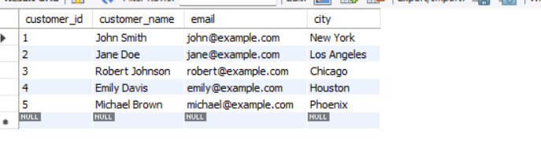

select * from orders;
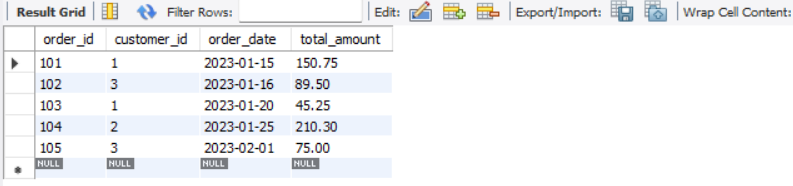

# Example 1: Basic LEFT JOIN
# Get all customers and their orders (if any)
    SELECT
    c.customer_id,
    c.customer_name,
    o.order_id,
    o.order_date,
    o.total_amount
    FROM
    customers c
    LEFT JOIN
    orders o ON c.customer_id = o.customer_id;
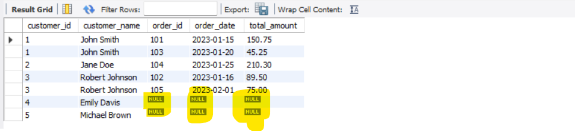

# Example 2: Finding customers with no orders
# Note the use of IS NULL in the WHERE clause
    SELECT
    c.customer_id,
    c.customer_name
    FROM
    customers c
    LEFT JOIN
    orders o ON c.customer_id = o.customer_id
    WHERE
    o.order_id IS NULL;
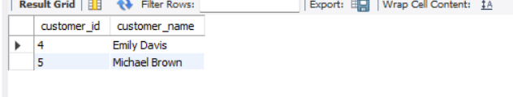

# Example 3: Using aggregate functions with LEFT JOIN
# Get customer order counts and total spending
    select c.customer_id,c.customer_name, count(o.order_id) AS 'Total Orders', sum(total_amount) AS 'SPENDING MONEY' from customers c
    left join orders o
    on c.customer_id = o.customer_id
    GROUP BY c.customer_id;
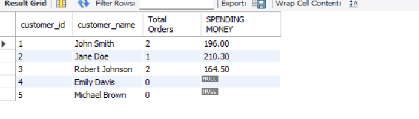

*** Here Total SPending NULL showing we want 0 instead.

    select c.customer_id,
    c.customer_name,
    count(o.order_id) AS 'Total Orders',
    Ifnull(sum(total_amount), 0) AS 'SPENDING MONEY' from customers c
    left join orders o
    on c.customer_id = o.customer_id
    GROUP BY c.customer_id;
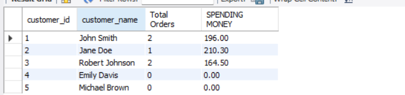

# Create shipping table for multiple joins example
        CREATE TABLE shipping (
        shipping_id INT PRIMARY KEY,
        order_id INT,
        shipping_date DATE,
        carrier VARCHAR(50),
        tracking_number VARCHAR(50),
        FOREIGN KEY (order_id) REFERENCES orders(order_id)
        );

# Insert sample shipping data
    INSERT INTO shipping (shipping_id, order_id, shipping_date, carrier, tracking_number)
    VALUES
    (1001, 101, '2023-01-16', 'FedEx', 'FDX123456789'),
    (1002, 104, '2023-01-26', 'UPS', 'UPS987654321'),
    (1003, 105, '2023-02-02', 'USPS', 'USPS456789123');

    select * from shipping;
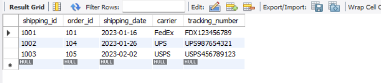

# Example 4: Multiple LEFT JOINs
# Get customers, their orders, and shipping information
    SELECT
    c.customer_name,
    o.order_id,
    o.order_date,
    o.total_amount,
    s.carrier,
    s.tracking_number
    FROM
    customers c
    LEFT JOIN
    orders o ON c.customer_id = o.customer_id
    LEFT JOIN
    shipping s ON o.order_id = s.order_id;
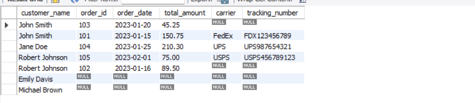

# Example 5: Filtering with WHERE vs. ON clause
# Method 1: Filter in WHERE clause (filters after join)
    SELECT
        c.customer_id,
        c.customer_name,
        c.city,
        o.order_id,
        o.order_date,
        o.total_amount
    FROM
        customers c
    LEFT JOIN
        orders o ON c.customer_id = o.customer_id
    WHERE
        c.city = 'New York';
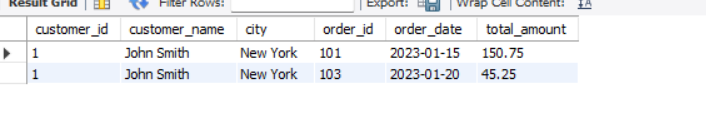

# Method 2: Filter in ON clause (maintains all left table rows)
    SELECT
        c.customer_id,
        c.customer_name,
        c.city,
        o.order_id,
        o.order_date,
        o.total_amount
    FROM
        customers c
    LEFT JOIN
        orders o ON c.customer_id = o.customer_id AND c.city = 'New York';
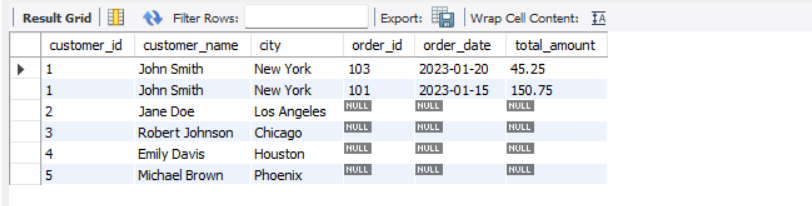

# Method 3: Using subquery to filter left table first
    SELECT
        c.customer_id,
        c.customer_name,
        c.city,
        o.order_id,
        o.order_date,
        o.total_amount
    FROM
        (SELECT * FROM customers WHERE city = 'New York') c
    LEFT JOIN
        orders o ON c.customer_id = o.customer_id;
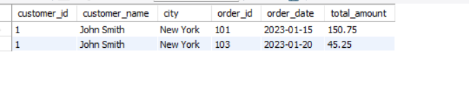

# Example 6: Advanced filtering with aggregation
# Find customers who haven't ordered in the past 30 days
    SELECT
    c.customer_id,
    c.customer_name,
    MAX(o.order_date) AS last_order_date
    FROM
    customers c
    LEFT JOIN
    orders o ON c.customer_id = o.customer_id
    GROUP BY
    c.customer_id, c.customer_name
    HAVING
    MAX(o.order_date) IS NULL
    OR MAX(o.order_date) < DATE_SUB(CURDATE(), INTERVAL 30 DAY);

