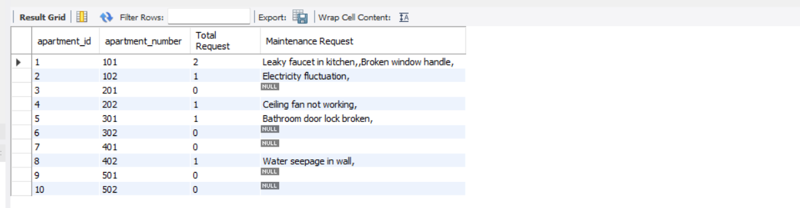

    CREATE DATABASE right_join_db;
    USE right_join_db;

# Create apartments table to store apartment information
    CREATE TABLE apartments (
    apartment_id INT PRIMARY KEY,
    apartment_number VARCHAR(10) NOT NULL,
    floor_number INT NOT NULL,
    wing_name CHAR(1) NOT NULL
    );

# Create residents table with foreign key to apartments
    CREATE TABLE residents (
    resident_id INT PRIMARY KEY,
    first_name VARCHAR(50) NOT NULL,
    last_name VARCHAR(50) NOT NULL,
    occupation VARCHAR(100),
    apartment_id INT,
    FOREIGN KEY (apartment_id) REFERENCES apartments(apartment_id)
    );

# Insert sample apartment data
    INSERT INTO apartments (apartment_id, apartment_number, floor_number, wing_name) VALUES
    (1, '101', 1, 'A'),
    (2, '102', 1, 'A'),
    (3, '201', 2, 'A'),
    (4, '202', 2, 'A'),
    (5, '301', 3, 'A'),
    (6, '302', 3, 'A'),
    (7, '401', 4, 'A'),
    (8, '402', 4, 'A'),
    (9, '501', 5, 'B'),
    (10, '502', 5, 'B');

# Insert sample resident data
    INSERT INTO residents (resident_id, first_name, last_name, occupation, apartment_id) VALUES
    (1, 'Jethalal', 'Gada', 'Electronics Shop Owner', 1),
    (2, 'Daya', 'Gada', 'Housewife', 1),
    (3, 'Taarak', 'Mehta', 'Writer', 2),
    (4, 'Anjali', 'Mehta', 'Teacher', 2),
    (5, 'Popatlal', 'Pandey', 'Reporter', 3),
    (6, 'Bhide', 'Aatmaram', 'School Teacher', 4),
    (7, 'Madhavi', 'Bhide', 'Housewife', 4),
    (8, 'Dr', 'Hathi', 'Doctor', 5),
    (9, 'Komal', 'Hathi', 'Housewife', 5);
# Note: We've left some apartments without residents
    
    select * from apartments;

    select * from residents;

# DEMO: LEFT JOIN to see all apartments and their residents (if any)
    SELECT a.apartment_number, a.floor_number, a.wing_name,
    r.first_name, r.last_name
    FROM apartments a
    LEFT JOIN residents r
    ON r.apartment_id = a.apartment_id;

# DEMO: RIGHT JOIN to see all apartments and their residents (if any)
    SELECT a.apartment_number, a.floor_number, a.wing_name,
    r.first_name, r.last_name
    FROM residents r
    RIGHT JOIN apartments a
    ON r.apartment_id = a.apartment_id;

*** We Can see Results will be same while we change the Order of Tables and LEFT JOIN to RIGHT JOIN.

# Create maintenance_requests table with foreign key to apartments
    CREATE TABLE maintenance_requests (
    request_id INT PRIMARY KEY,
    apartment_id INT,
    request_date DATE NOT NULL,
    description TEXT NOT NULL,
    status ENUM('Pending', 'In Progress', 'Completed') DEFAULT 'Pending',
    FOREIGN KEY (apartment_id) REFERENCES apartments(apartment_id)
    );

# Insert sample maintenance request data
    INSERT INTO maintenance_requests (request_id, apartment_id, request_date, description, status) VALUES
    (1, 1, '2023-01-15', 'Leaky faucet in kitchen', 'Completed'),
    (2, 1, '2023-02-20', 'Broken window handle', 'Completed'),
    (3, 2, '2023-03-10', 'Electricity fluctuation', 'In Progress'),
    (4, 4, '2023-03-15', 'Ceiling fan not working', 'Pending'),
    (5, 5, '2023-04-01', 'Bathroom door lock broken', 'Completed'),
    (6, 8, '2023-04-10', 'Water seepage in wall', 'In Progress');

    select * from maintenance_requests;

# EXERCISE 1: Finding Unoccupied Apartments
    SELECT a.apartment_id, a.apartment_number, a.floor_number, a.wing_name
    FROM apartments a
    LEFT JOIN residents r ON a.apartment_id = r.apartment_id
    WHERE r.resident_id IS NULL;

    select * from residents r
    RIGHT JOIN apartments a
    ON r.apartment_id = a.apartment_id
    WHERE r.resident_id IS NULL;

# EXERCISE 2: Count the number of residents per apartment
    SELECT a.apartment_id, a.apartment_number, COUNT(r.resident_id) AS resident_count
    FROM apartments a
    LEFT JOIN residents r ON a.apartment_id = r.apartment_id
    GROUP BY a.apartment_id;

    
    select a.apartment_id, count(resident_id) AS resident_count
    from apartments a
    LEFT JOIN residents r
    ON r.apartment_id = a.apartment_id
    GROUP BY a.apartment_id;

# EXERCISE 3: List all apartments with their residents and maintenance request status
    SELECT
        a.apartment_id,
        a.apartment_number,
        a.floor_number,
        a.wing_name,
        CONCAT(r.first_name, ' ', r.last_name) AS resident_name,
        mr.status AS maintenance_status
    FROM
        apartments a
    LEFT JOIN
        residents r ON a.apartment_id = r.apartment_id
    LEFT JOIN
        maintenance_requests mr ON a.apartment_id = mr.apartment_id;

    SELECT a.apartment_id, a.apartment_number, r.resident_id, concat(r.first_name,' ',r.last_name), m.description, m.status
    FROM apartments a
    LEFT JOIN residents r
    ON a.apartment_id = r.apartment_id
    LEFT JOIN maintenance_requests m
    ON a.apartment_id = m.apartment_id;

# EXERCISE 4: Write a query to find the floor with the most unoccupied apartments

    SELECT
        floor_number,
        wing_name,
        COUNT(*) AS unoccupied_count
    FROM
        apartments a
    LEFT JOIN
        residents r ON a.apartment_id = r.apartment_id
    WHERE
        r.resident_id IS NULL
    GROUP BY
        floor_number, wing_name
    ORDER BY
        unoccupied_count DESC
    LIMIT 1;

# EXERCISE 5: Write a query to list all apartments along with the total number of maintenance requests

    select a.apartment_id,  a.apartment_number, COUNT(m.request_id) AS 'Total Request', group_concat(description, ',') AS 'Maintenance Request'
    FROM apartments a
    LEFT JOIN 
        maintenance_requests m ON a.apartment_id = m.apartment_id
    GROUP BY 
        a.apartment_id;

    SELECT
        a.apartment_id,
        a.apartment_number,
        a.floor_number,
        a.wing_name,
    COUNT(mr.request_id) AS maintenance_request_count
    FROM
        apartments a
    LEFT JOIN
        maintenance_requests mr ON a.apartment_id = mr.apartment_id
    GROUP BY
        a.apartment_id;

