# Self JOIN in SQL Demonstration
# This script demonstrates how to use Self JOINs to query hierarchical and relational data
# within the same table, using an employee management system example.

# Create and use database
    CREATE DATABASE self_join_db;
    USE self_join_db;

# Create employees table with manager_id referencing the same table
    CREATE TABLE employees (
    employee_id INT PRIMARY KEY,
    first_name VARCHAR(50),
    last_name VARCHAR(50),
    job_title VARCHAR(100),
    salary DECIMAL(10, 2),
    department VARCHAR(50),
    manager_id INT,
    hire_date DATE
    );

# Insert sample employee data with hierarchical management structure
    INSERT INTO employees VALUES
    (1, 'James', 'Smith', 'CEO', 150000.00, 'Executive', NULL, '2010-01-15'),
    (2, 'Sarah', 'Johnson', 'CTO', 140000.00, 'Technology', 1, '2011-03-10'),
    (3, 'Michael', 'Williams', 'CFO', 140000.00, 'Finance', 1, '2012-07-22'),
    (4, 'Jessica', 'Brown', 'HR Director', 110000.00, 'Human Resources', 1, '2013-05-18'),
    (5, 'David', 'Miller', 'Senior Developer', 95000.00, 'Technology', 2, '2014-11-05'),
    (6, 'Emily', 'Davis', 'Developer', 80000.00, 'Technology', 5, '2016-08-12'),
    (7, 'Robert', 'Wilson', 'Junior Developer', 65000.00, 'Technology', 5, '2019-02-28'),
    (8, 'Jennifer', 'Taylor', 'Accountant', 75000.00, 'Finance', 3, '2015-09-17'),
    (9, 'Thomas', 'Anderson', 'Accountant', 72000.00, 'Finance', 3, '2017-06-24'),
    (10, 'Lisa', 'Martinez', 'HR Specialist', 68000.00, 'Human Resources', 4, '2018-04-30');

    select * from employees
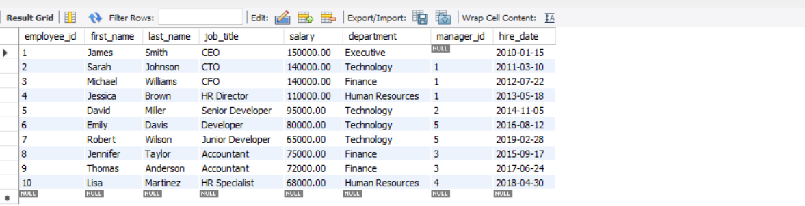

# EXAMPLE 1: Basic Self JOIN to show employees with their managers
# This joins the employees table with itself to match employees with manager information

    select *
    from employees e
    join employees mgr
    on e.manager_id = mgr.employee_id;      Note- Employee ki manager-Id same h Manager ki Employee-Id
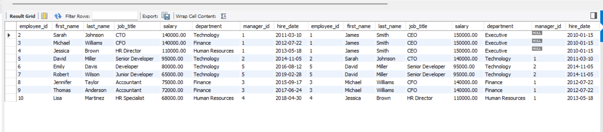
    
    select e.employee_id, e.first_name, e.last_name, e.job_title, e.department, mgr.employee_id as 'Manager emp Id', mgr.first_name, mgr.last_name, mgr.last_name, mgr.job_title as 'manager job title'
    from employees e
    join employees mgr
    on e.manager_id = mgr.employee_id;
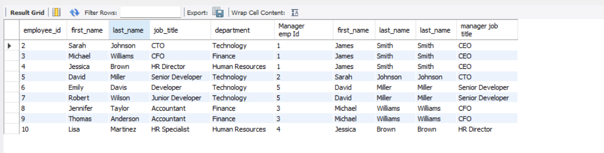

# EXAMPLE 2: Self JOIN with LEFT JOIN to include all employees (including CEO with no manager)
# This ensures even employees without managers (like the CEO) are included in results
    SELECT * FROM employees emp
    LEFT JOIN employees mgr ON emp.manager_id = mgr.employee_id;
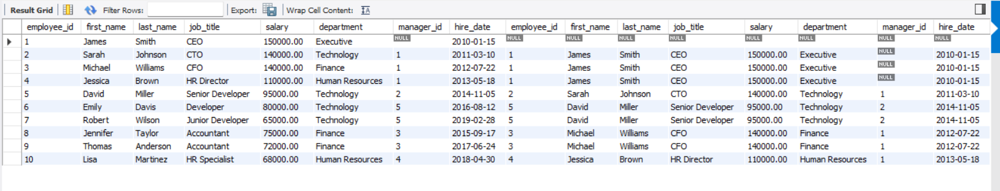

# EXAMPLE 3: Group employees by department
# Not a self join, but useful for context
# EXAMPLE 3: Group employees by department
# Not a self join, but useful for context
    select department, count(*) as 'Total Employees',
    group_concat(first_name separator ' , ')
    from employees
    group by department;
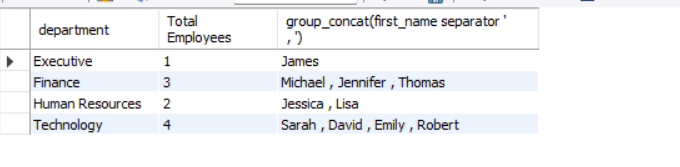

    select department, count(*) as 'Total Employees',
    group_concat(concat(first_name, ' ', last_name) separator ' , ') AS employees
    from employees
    group by department;
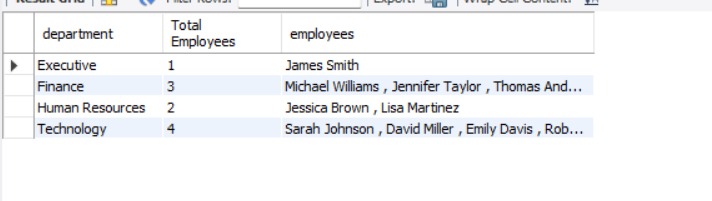

    SELECT
        department,
        COUNT(*) AS employee_count,
        GROUP_CONCAT(CONCAT(first_name, ' ', last_name) ORDER BY employee_id SEPARATOR ', ') AS employees
    FROM
        employees
    GROUP BY
        department;

# EXAMPLE 4: Find employees who work in the same department
# Self join to match employees with their colleagues in the same department
# The condition e1.employee_id < e2.employee_id prevents duplicates and self-matches
    SELECT * FROM employees e1
    JOIN employees e2 ON e1.department = e2.department AND e1.employee_id < e2.employee_id;
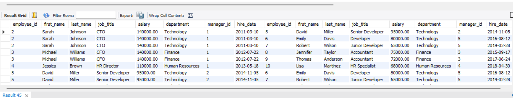

# EXAMPLE 5: Find employees who make less than their managers
# Self join to compare employee salaries with their manager's salary
    SELECT * FROM employees emp
    JOIN employees mgr ON emp.manager_id = mgr.employee_id
    WHERE emp.salary < mgr.salary;
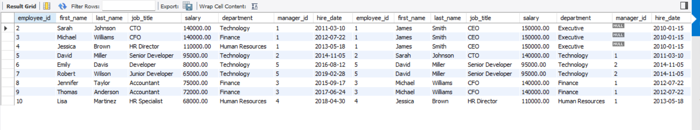
    
    select e.employee_id, concat(e.first_name, ' ', e.last_name) as 'Name', e.salary as 'Employee Salary'
    from employees e
    Left Join employees mgr
    on e.manager_id = mgr.employee_id
    where e.salary < mgr.salary; 
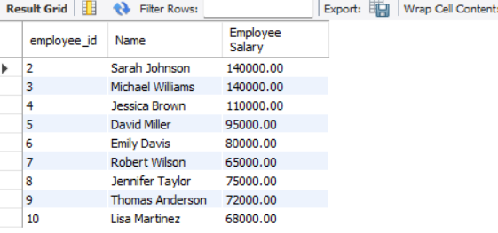

    select *
    from employees e
    Left Join employees mgr
    on e.manager_id = mgr.employee_id
    where e.salary < mgr.salary; 
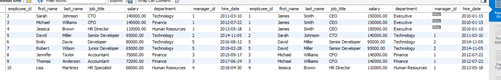

# EXAMPLE 6: Calculate average salary difference between employees and managers by department
# This shows how to use aggregate functions with self joins

    select e.department, count(*) as 'no. of employees', avg(e.salary) as emp_avg_salary, avg(m.salary) as mgr_avg_salary, avg(m.salary-e.salary) avg_salary_difference
    from employees e
    join employees m
    on e.manager_id = m.employee_id
    group by e.department;

    
    SELECT
    emp.department,
    COUNT(emp.employee_id) AS num_employees,
    ROUND(AVG(mgr.salary), 2) AS avg_manager_salary,
    ROUND(AVG(emp.salary), 2) AS avg_employee_salary,
    ROUND(AVG(mgr.salary - emp.salary), 2) AS avg_salary_difference
    FROM
    employees emp
    JOIN
    employees mgr ON emp.manager_id = mgr.employee_id
    GROUP BY
    emp.department
    ORDER BY
    avg_salary_difference DESC;
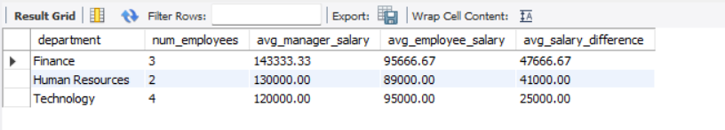

