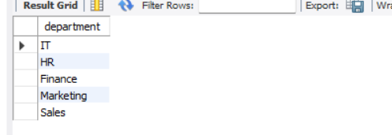

-- ====================================================================
# MySQL UNION Lecture - Complete SQL Script
-- ====================================================================

# Introduction to UNION and UNION ALL
-- ====================================================================
-- UNION allows us to combine result sets from multiple SELECT queries into a single result set
-- Key points:
-- - Combines rows from multiple queries into a single result set
-- - Appends rows vertically (stacks them on top of each other)
-- - Requires that all queries have the same number of columns
-- - Column data types must be compatible across all queries
-- - Eliminates duplicate rows by default (use UNION ALL to keep duplicates)
-- - Uses the column names from the first SELECT statement for the final result set
-- - Ignores column names from subsequent queries

#  Database Setup
# ====================================================================
CREATE DATABASE union_demo_db;
USE union_demo_db;

# Create tables for our demonstration
    CREATE TABLE headquarters_employees (
    employee_id INT PRIMARY KEY,
    first_name VARCHAR(50),
    last_name VARCHAR(50),
    email VARCHAR(100),
    hire_date DATE,
    department VARCHAR(50),
    salary DECIMAL(10,2)
    );

    CREATE TABLE branch_employees (
    employee_id INT PRIMARY KEY,
    first_name VARCHAR(50),
    last_name VARCHAR(50),
    email VARCHAR(100),
    hire_date DATE,
    department VARCHAR(50),
    salary DECIMAL(10,2)
    );

    CREATE TABLE customers (
    customer_id INT PRIMARY KEY,
    first_name VARCHAR(50),
    last_name VARCHAR(50),
    email VARCHAR(100),
    signup_date DATE,
    status VARCHAR(20)
    );

# Sample Data
# ====================================================================
# Insert data into headquarters_employees
    INSERT INTO headquarters_employees VALUES
    (101, 'John', 'Smith', 'john.smith@company.com', '2018-03-15', 'IT', 75000.00),
    (102, 'Mary', 'Johnson', 'mary.johnson@company.com', '2019-06-22', 'HR', 65000.00),
    (103, 'Robert', 'Williams', 'robert.williams@company.com', '2017-11-08', 'Finance', 82000.00),
    (104, 'Susan', 'Brown', 'susan.brown@company.com', '2020-01-30', 'Marketing', 68000.00),
    (105, 'Michael', 'Davis', 'michael.davis@company.com', '2018-09-12', 'IT', 78000.00);

# Insert data into branch_employees
    INSERT INTO branch_employees VALUES
    (201, 'James', 'Wilson', 'james.wilson@company.com', '2019-04-18', 'Sales', 62000.00),
    (202, 'Patricia', 'Moore', 'patricia.moore@company.com', '2020-07-25', 'Marketing', 59000.00),
    (203, 'Linda', 'Taylor', 'linda.taylor@company.com', '2018-08-15', 'HR', 61000.00),
    (204, 'Robert', 'Williams', 'robert.williams@company.com', '2017-11-08', 'Finance', 82000.00), -- Duplicate employee who works at both locations
    (205, 'Elizabeth', 'Anderson', 'elizabeth.anderson@company.com', '2019-12-03', 'Sales', 64000.00);

# Insert data into customers
    INSERT INTO customers VALUES
    (1001, 'David', 'Miller', 'david.miller@email.com', '2019-02-14', 'Active'),
    (1002, 'Sarah', 'Wilson', 'sarah.wilson@email.com', '2020-05-20', 'Active'),
    (1003, 'Michael', 'Davis', 'michael.davis@email.com', '2018-11-30', 'Inactive'), -- Same name as an employee
    (1004, 'Jennifer', 'Garcia', 'jennifer.garcia@email.com', '2021-01-05', 'Active'),
    (1005, 'Robert', 'Martinez', 'robert.martinez@email.com', '2019-08-22', 'Active');

# View table data
# ====================================================================

    SELECT * FROM headquarters_employees;

    SELECT * FROM branch_employees;

    SELECT * FROM customers;

# Basic UNION Examples
====================================================================
# Example 1: UNION vs UNION ALL
# Get a list of all employees from both locations (without duplicates)
    SELECT first_name, last_name, email FROM headquarters_employees
    UNION
    SELECT first_name, last_name, email FROM branch_employees;

# Get a list of all employees from both locations (including duplicates)
    SELECT first_name, last_name, email FROM headquarters_employees
    UNION ALL
    SELECT first_name, last_name, email FROM branch_employees;

# Example 2: Combining full tables
    SELECT * FROM headquarters_employees
    UNION ALL
    SELECT * FROM branch_employees;

# Advanced UNION Examples
# ====================================================================

# Example 3: Adding a descriptor column
# Combine employee and customer contact information with a type indicator

*** we are doing Union with headquarters_employees and customers table
    because both tables are having different no. of columns so if we 
    do * it will through an exception but if we do union on same number
    of columns then no issues.
    
    SELECT first_name, last_name, email, 'Employee' AS contact_type
    FROM headquarters_employees
    UNION
    SELECT first_name, last_name, email, 'Customer' AS contact_type
    FROM customers;

    SELECT * FROM headquarters_employees        # Error -15:57:56	SELECT * FROM headquarters_employees     UNION     SELECT * FROM customers	Error Code: 1222. The used SELECT statements have a different number of columns	0.000 sec
    UNION
    SELECT * FROM customers;

# Example 4: Ordering results after UNION
# Get all employees sorted by last name
    SELECT employee_id, first_name, last_name, department
    FROM headquarters_employees
    UNION
    SELECT employee_id, first_name, last_name, department
    FROM branch_employees
    ORDER BY last_name;

# Example 5: Filtering before UNION
# Get employees with salary over 70000
    SELECT employee_id, first_name, last_name, department, salary
    FROM headquarters_employees
    WHERE salary > 70000
    UNION
    SELECT employee_id, first_name, last_name, department, salary
    FROM branch_employees
    WHERE salary > 70000
    ORDER BY salary DESC;

# Handling Different Column Structures
# ====================================================================
# Example 6: Handling different table structures with NULL values
    SELECT employee_id, first_name, last_name, department, salary, NULL AS status
    FROM headquarters_employees
    UNION
    SELECT customer_id, first_name, last_name, NULL, NULL, status
    FROM customers
    ORDER BY first_name, last_name;

# Practical Use Cases
# ====================================================================
# Example 7: Finding all unique departments across locations
    SELECT department
    FROM headquarters_employees
    UNION
    SELECT department
    FROM branch_employees;

# Example 8: Finding common departments (advanced)
# Departments that exist in both headquarters and branch offices
  
    SELECT department FROM (
    SELECT DISTINCT department
    FROM headquarters_employees
    UNION ALL
    SELECT DISTINCT department
    FROM branch_employees
    ) AS combined
    GROUP BY department
    HAVING COUNT(*) = 2;
