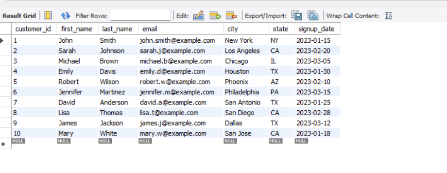
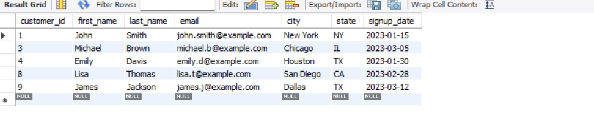

-- =============================================
# MySQL Subqueries Demonstration
# Online Store Database Example
-- =============================================

   ***** If you are using FROM with Sub-Query then you must have to use
                ALIAS either you are going to use it or not *********

# Create database and set it as the active database
CREATE DATABASE sub_queries_online_store;
USE sub_queries_online_store;

-- =============================================
# TABLE CREATION
-- =============================================

# Create customers table
    CREATE TABLE customers (
        customer_id INT PRIMARY KEY AUTO_INCREMENT,
        first_name VARCHAR(50) NOT NULL,
        last_name VARCHAR(50) NOT NULL,
        email VARCHAR(100) UNIQUE NOT NULL,
        city VARCHAR(50),
        state VARCHAR(2),
        signup_date DATE
    );

# Create products table
    CREATE TABLE products (
        product_id INT PRIMARY KEY AUTO_INCREMENT,
        product_name VARCHAR(100) NOT NULL,
        category VARCHAR(50) NOT NULL,
        price DECIMAL(10, 2) NOT NULL,
        stock_quantity INT NOT NULL
    );

# Create orders table
    CREATE TABLE orders (
        order_id INT PRIMARY KEY AUTO_INCREMENT,
        customer_id INT NOT NULL,
        order_date DATETIME NOT NULL,
        total_amount DECIMAL(10, 2) NOT NULL,
        FOREIGN KEY (customer_id) REFERENCES customers(customer_id)
    );

# Create order_items table
    CREATE TABLE order_items (
        item_id INT PRIMARY KEY AUTO_INCREMENT,
        order_id INT NOT NULL,
        product_id INT NOT NULL,
        quantity INT NOT NULL,
        item_price DECIMAL(10, 2) NOT NULL,
        FOREIGN KEY (order_id) REFERENCES orders(order_id),
        FOREIGN KEY (product_id) REFERENCES products(product_id)
    );

-- =============================================
# SAMPLE DATA INSERTION
-- =============================================

# Insert data into customers
    INSERT INTO customers (first_name, last_name, email, city, state, signup_date) VALUES
    ('John', 'Smith', 'john.smith@example.com', 'New York', 'NY', '2023-01-15'),
    ('Sarah', 'Johnson', 'sarah.j@example.com', 'Los Angeles', 'CA', '2023-02-20'),
    ('Michael', 'Brown', 'michael.b@example.com', 'Chicago', 'IL', '2023-03-05'),
    ('Emily', 'Davis', 'emily.d@example.com', 'Houston', 'TX', '2023-01-30'),
    ('Robert', 'Wilson', 'robert.w@example.com', 'Phoenix', 'AZ', '2023-02-10'),
    ('Jennifer', 'Martinez', 'jennifer.m@example.com', 'Philadelphia', 'PA', '2023-03-15'),
    ('David', 'Anderson', 'david.a@example.com', 'San Antonio', 'TX', '2023-01-25'),
    ('Lisa', 'Thomas', 'lisa.t@example.com', 'San Diego', 'CA', '2023-02-28'),
    ('James', 'Jackson', 'james.j@example.com', 'Dallas', 'TX', '2023-03-12'),
    ('Mary', 'White', 'mary.w@example.com', 'San Jose', 'CA', '2023-01-18');

# Insert data into products
    INSERT INTO products (product_name, category, price, stock_quantity) VALUES
    ('Laptop Pro', 'Electronics', 1299.99, 25),
    ('Smartphone X', 'Electronics', 899.99, 50),
    ('Wireless Headphones', 'Electronics', 199.99, 100),
    ('Coffee Maker', 'Home Appliances', 79.99, 30),
    ('Blender', 'Home Appliances', 49.99, 40),
    ('Running Shoes', 'Sports', 129.99, 75),
    ('Yoga Mat', 'Sports', 29.99, 120),
    ('Mystery Novel', 'Books', 14.99, 200),
    ('Cookbook', 'Books', 24.99, 150),
    ('Desk Chair', 'Furniture', 149.99, 15);

# Insert data into orders
    INSERT INTO orders (customer_id, order_date, total_amount) VALUES
    (1, '2023-04-10 14:30:00', 1499.98),
    (2, '2023-04-11 10:15:00', 249.98),
    (3, '2023-04-12 16:45:00', 899.99),
    (4, '2023-04-13 13:20:00', 1329.98),
    (2, '2023-04-14 09:30:00', 49.99),
    (5, '2023-04-15 15:10:00', 179.98),
    (6, '2023-04-16 11:05:00', 159.98),
    (7, '2023-04-17 14:55:00', 39.98),
    (8, '2023-04-18 12:40:00', 899.99),
    (9, '2023-04-19 16:25:00', 229.98),
    (10, '2023-04-20 10:50:00', 279.97),
    (1, '2023-04-21 13:35:00', 24.99),
    (3, '2023-04-22 15:15:00', 129.99);

# Insert data into order_items
    INSERT INTO order_items (order_id, product_id, quantity, item_price) VALUES
    (1, 1, 1, 1299.99),
    (1, 3, 1, 199.99),
    (2, 5, 1, 49.99),
    (2, 7, 1, 29.99),
    (2, 9, 1, 24.99),
    (3, 2, 1, 899.99),
    (4, 1, 1, 1299.99),
    (4, 6, 1, 129.99),
    (5, 5, 1, 49.99),
    (6, 4, 1, 79.99),
    (6, 8, 1, 14.99),
    (6, 9, 1, 24.99),
    (7, 6, 1, 129.99),
    (7, 8, 2, 14.99),
    (8, 8, 1, 14.99),
    (8, 9, 1, 24.99),
    (9, 2, 1, 899.99),
    (10, 3, 1, 199.99),
    (10, 6, 1, 129.99),
    (11, 5, 1, 49.99),
    (11, 7, 1, 29.99),
    (11, 8, 1, 14.99),
    (12, 9, 1, 24.99),
    (13, 6, 1, 129.99);

# view all data tables
    select * from customers;

    select * from products;

    select * from orders;

    select * from order_items;

-- =============================================
# BASIC SUBQUERIES
-- =============================================
# Important >>
# Q.1  Find all customers who have placed at least one order
        we have a customers table where all informations about customers are there. we have one more table orders which contains
        which order placed by which customers. 
        customers -> c1, c2, c3, c4
        orders -> o1-c1, o2-c2, o3-c3...
        ** from orders table take all customers id and check in customers table if that id is present if yes then they place the order

    SELECT * FROM customers
    WHERE customer_id IN (
    SELECT DISTINCT customer_id FROM orders
    );
  

    select * from customers where customer_id in (select customer_id from orders);
  

# Q.2  Finding customers who haven't placed orders
    SELECT * FROM customers
    WHERE customer_id NOT IN (
    SELECT DISTINCT customer_id FROM orders
    );

    NULL: which mean all the customers has placed an order at least once

# Q.3 Find products with a price higher than average
    SELECT * FROM products
    WHERE price > (
        SELECT AVG(price) FROM products
    );

-- =============================================
# GROUP BY WITH HAVING
-- =============================================

# Q.4 Find categories that have more than 2 products
    select category, count(*) as total_no_of_products
    from products
    group by category
    having total_no_of_products > 2;

    
    SELECT category, COUNT(*)
    FROM products
    GROUP BY category
    HAVING COUNT(*) > 2;

-- =============================================
# SUBQUERIES IN THE WHERE CLAUSE
-- =============================================

# Q.5  Find all orders made by customers from Texas
    SELECT * FROM orders
    WHERE customer_id IN (
    SELECT customer_id FROM customers WHERE state = 'TX'
    );
  

# Alternative using JOIN
    select * from customers c
    join orders o
    on c.customer_id = o.customer_id and c.state = 'TX'
  

    SELECT * FROM customers c
    JOIN orders o ON c.customer_id = o.customer_id
    WHERE c.state = 'TX';
  

-- =============================================
# JOIN QUERIES VS SUBQUERIES
-- =============================================

# Q.6 Find all customers who ordered electronics products
    -- Using join
    SELECT * FROM customers c
    JOIN orders o ON c.customer_id=o.customer_id
    JOIN order_items oitm ON o.order_id=oitm.order_id
    JOIN products p ON oitm.product_id=p.product_id
    WHERE p.category='Electronics';
  

    -- Using subqueries
    SELECT * FROM customers c
    JOIN orders o ON c.customer_id=o.customer_id
    JOIN order_items oitm ON o.order_id=oitm.order_id
    WHERE product_id IN(
    SELECT p.product_id FROM products p
    WHERE p.category='Electronics'
    );
  

-- =============================================
# SUBQUERIES WITH AVERAGE CALCULATION
-- =============================================

# Customers who spent more than average
# 1. Calculate the total amount spent by each customer
# 2. Calculate the average total spending across all customers
# 3. Identify customers whose total spending exceeds this average

-- Customers who spent more than average

    SELECT * FROM customers c
    JOIN orders o ON c.customer_id=o.customer_id
    where total_amount > (
    select avg(o.total_amount) from orders o
    );

-- Calculate the total amount spent by each customer

    SELECT c.customer_id, CONCAT(c.first_name, ' ', c.last_name), SUM(o.total_amount) as total_amount_spent_by_customer
    FROM customers c
    JOIN orders o ON c.customer_id=o.customer_id
    GROUP BY c.customer_id;

# Follow Each Steps Important Concepts
# Customers who spent more than average

# 1. Calculate the total amount spent by each customer
# 2. Calculate the average total spending across all customers
# 3. Identify customers whose total spending exceeds this average

Explanation Below:-

   # step -1 Calculate the total amount spent by each customer
     SELECT customer_id, SUM(total_amount) AS total_spent FROM orders GROUP BY customer_id;
   

    *** i have created total_spent one as an ALIAS because we are going to use this as a Sub-Query
        because we are going to find the average of this. this result_set column total_spent we are
        going to use.

   # step -2 Calculate the average total spending across all customers 
    SELECT AVG(total_spent) AS average_customer_spending
    FROM (
            SELECT customer_id, SUM(total_amount) AS total_spent FROM orders GROUP BY customer_id
         ); 

    <><> But we are getting Exception -  Error Code: 1248. Every derived table must have its own alias
   
    
   # here syntax is FROM Sub-Queries Results; till now we were using IN, WHERE from sub-query which was giving only one fields 
   # now first time before sub-query result we have putted FROM, so, IF you are using FROM Sub-Queries result then in that case
   # you must have to use one ALIAS. so, Every derived table must have its own alias, Here, derived table means temporary table.
   # when we were using IN then MYSQL was understanding that you are comparing with a list of Values. while less than or greater
   # than then only one value But Here using FROM, so here we might have multiple columns. so we need to write multiple columns there..
   # we are talikg this column from derived table or that column from derived table. so, that's the reason mysql is forcing to give an
   # ALIAS name to our temporarly derived table.

    SELECT AVG(total_spent) AS average_customer_spending
    FROM (
    SELECT customer_id, SUM(total_amount) AS total_spent FROM orders GROUP BY customer_id
    ) AS customer_total;
   

   # step -3 Identify customers whose total spending exceeds this average
   -- using sub query
   
    SELECT * FROM customers
    WHERE (SELECT SUM(total_amount) FROM orders WHERE customer_id = customers.customer_id) >
    (SELECT AVG(total_spent) AS average_customer_spending FROM (SELECT customer_id, SUM(total_amount) AS total_spent FROM orders GROUP BY customer_id) AS customer_total);
   

  -- using join

    SELECT * FROM customers c
    JOIN orders o ON c.customer_id=o.customer_id
    WHERE total_amount >
    (SELECT AVG(total_spent) AS average_customer_spending FROM (SELECT customer_id, SUM(total_amount) AS total_spent FROM orders GROUP BY customer_id) AS customer_total);
   

    SELECT *,
    (SELECT SUM(total_amount) FROM orders WHERE customer_id = customers.customer_id) AS total_spent
    FROM customers
    WHERE
    (SELECT SUM(total_amount) FROM orders WHERE customer_id = customers.customer_id) >
    (SELECT AVG(total_spent) AS average_customer_spending FROM
    (SELECT customer_id, SUM(total_amount) AS total_spent FROM orders GROUP BY customer_id) AS customer_total);
   

-- =============================================
 # COMPLEX SUBQUERIES
-- =============================================

# Find customers who have ordered all products in the 'Electronics' category

  # sub tasks 1 <# find In each Category how many products and all products Name within same category>
    select category, count(product_name),
    group_concat(product_name separator ' , ') as all_product_name
    from products
    group by category
    having category = 'Electronics';

  # sub tasks 2 <# Find customers who have ordered at least one products from 'Electronics' category>
    SELECT * FROM customers c
    JOIN orders o ON c.customer_id=o.customer_id
    JOIN order_items oitm ON o.order_id=oitm.order_id
    JOIN products p ON oitm.product_id=p.product_id
    where p.category = 'Electronics';

  # sub tasks 3 <#Find each customers bought how many Electronics Category Item then later compare with distinct == 3, which mean they bought all items>
    SELECT c.customer_id, c.email, count(p.product_id) AS product_count, group_concat(p.product_name separator ',') AS product_names FROM customers c
    JOIN orders o ON c.customer_id=o.customer_id
    JOIN order_items oitm ON o.order_id=oitm.order_id
    JOIN products p ON oitm.product_id=p.product_id
    WHERE p.category = "Electronics"
    GROUP BY c.customer_id;

  # Find customers who have ordered all products in the 'Electronics' category  -- there might be one customer bought same item 2 times so we used distinct
    SELECT c.customer_id, c.email, count(distinct(p.product_id)) AS product_count, group_concat(p.product_name separator ',') AS product_names FROM customers c
    JOIN orders o ON c.customer_id=o.customer_id
    JOIN order_items oitm ON o.order_id=oitm.order_id
    JOIN products p ON oitm.product_id=p.product_id
    WHERE p.category = "Electronics"
    GROUP BY c.customer_id
    HAVING product_count = (SELECT COUNT(*) FROM products WHERE category = 'Electronics');

    [ None of the customers who bought all the products from Electronics Category ]

# Find all customers who are not from California but have purchased the same product-quantity combinations as California customers

   # sub-task 1 <First we need california product & quantity combinations then only we can do matching>
    SELECT oitm.product_id, oitm.quantity FROM customers c
    JOIN orders o ON c.customer_id=o.customer_id
    JOIN order_items oitm ON o.order_id=oitm.order_id
    WHERE c.state='CA';

   # sub-task 2 <Second we need to find that customers who are not in california>
    SELECT c.customer_id, c.email FROM customers c
    JOIN orders o ON c.customer_id=o.customer_id
    JOIN order_items oitm ON o.order_id=oitm.order_id
    WHERE c.state !='CA';

 -- ** Important: now we have to compare product & quantity together

   # Find all customers who are not from California but have purchased the same product-quantity combinations as California customers
    SELECT c.customer_id, c.email FROM customers c
    JOIN orders o ON c.customer_id=o.customer_id
    JOIN order_items oitm ON o.order_id=oitm.order_id
    WHERE c.state !='CA'
    AND (oitm.product_id, oitm.quantity) IN      -- this is called row constructor/ value constructor/touple constructor [ both the things we are comparing together)
    (SELECT oitm.product_id, oitm.quantity FROM customers c
    JOIN orders o ON c.customer_id=o.customer_id
    JOIN order_items oitm ON o.order_id=oitm.order_id
    WHERE c.state='CA');

    SELECT c.email, c.state, p.product_name, oi.quantity FROM customers c
    JOIN orders o ON c.customer_id = o.customer_id
    JOIN order_items oi ON oi.order_id = o.order_id
    JOIN products p ON oi.product_id = p.product_id
    WHERE c.state != 'CA'
    AND (oi.product_id, oi.quantity) IN
    (SELECT oi.product_id, oi.quantity FROM customers c
    JOIN orders o ON c.customer_id = o.customer_id
    JOIN order_items oi ON oi.order_id = o.order_id
    WHERE c.state = 'CA');

-- =============================================
# CORRELATED SUBQUERIES AND EXISTS
-- =============================================

# Correlated Subqueries
    A correlated subquery is a subquery that uses values from the outer query.
    Unlike regular subqueries which can be executed independently, correlated subqueries are dependent on the outer query and
    must be re-evaluated for each row processed by the outer query.
    Can Appear in Various SQL Clauses (SELECT / WHERE / HAVING)

# Scalar subquery
    Always Returns Exactly One Value
    Can Be Independent or Correlated
    Can Appear in Various SQL Clauses (SELECT / WHERE / HAVING)

# why to use EXISTS in our sub-queries.

       EXISTS is a Logical Operator that is used with a Sub-Queries to Check Any Results are coming from Sub-Queries or not.
       If you just want to check Existence and does not require data, then you can use SELECT 1.
       If you are using Exists directly, you can use select 1 for performance benefit.
       In Large Data Sets, Join could be an Expensive operation.
       If you are checking only Existence, then use EXISTS otherwise you can use JOINS.

#  Find customers who have placed at least one order
# Using JOIN
    SELECT DISTINCT c.customer_id, c.email
    FROM customers c
    JOIN orders o ON c.customer_id = o.customer_id
    ORDER BY c.customer_id;

# Using EXISTS
    SELECT * FROM customers c
    WHERE EXISTS (
    SELECT 1 FROM orders o WHERE c.customer_id = o.customer_id
    );

# Find customers who haven't placed any orders
    SELECT * FROM customers c
    WHERE NOT EXISTS (
    SELECT 1 FROM orders o WHERE c.customer_id = o.customer_id
    );

# Products that have never been ordered
    SELECT * FROM products p
    WHERE NOT EXISTS (
    SELECT 1 FROM order_items oi WHERE oi.product_id = p.product_id
    );

# Find customers who have ordered electronics products
# Using JOINs
    SELECT DISTINCT c.customer_id, c.first_name, c.last_name
    FROM customers c
    JOIN orders o ON c.customer_id = o.customer_id
    JOIN order_items oi ON o.order_id = oi.order_id
    JOIN products p ON oi.product_id = p.product_id
    WHERE p.category = 'Electronics';

# Using EXISTS
    SELECT * FROM customers c
    WHERE EXISTS (
    SELECT 1 FROM orders o
    JOIN order_items oi ON o.order_id = oi.order_id
    JOIN products p ON oi.product_id = p.product_id
    WHERE c.customer_id = o.customer_id
    AND p.category = 'Electronics'
    );
