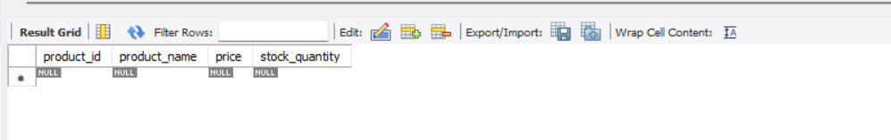

# Key differences between TRUNCATE and DELETE:
     Speed: TRUNCATE is generally faster because it drops and recreates the table rather than removing rows one by one.
     Logging: DELETE logs individual row removals, while TRUNCATE only logs table deallocation.
     WHERE clause: DELETE supports WHERE conditions to remove specific rows, while TRUNCATE always removes all rows.
     Auto-increment: TRUNCATE resets auto-increment counters to their initial value, while DELETE preserves the current counter value.
     Triggers: DELETE activates DELETE triggers, while TRUNCATE does not fire any triggers.
     Rollback: DELETE operations can be rolled back in a transaction, while TRUNCATE generally cannot
     SQL Categories: TRUNCATE is a DDL (Data Definition Language) command, DELETE is a DML (Data Manipulation Language) command

# Demonstrates how to remove records from a database table
    DELETE FROM table_name WHERE condition;

# Create a database for our examples
    CREATE DATABASE delete_db;

# Use the database
    USE delete_db;

# Create a simple product inventory table
    CREATE TABLE products (
        product_id INT PRIMARY KEY,
        product_name VARCHAR(100),
        price DECIMAL(10, 2),
        stock_quantity INT
    );

# Insert sample data
    INSERT INTO products VALUES
    (1, 'Laptop', 999.99, 10),
    (2, 'Smartphone', 499.99, 25),
    (3, 'Headphones', 89.99, 50),
    (4, 'Tablet', 349.99, 15),
    (5, 'Keyboard', 59.99, 30),
    (6, 'Mouse', 29.99, 45),
    (7, 'Monitor', 249.99, 12),
    (8, 'Printer', 179.99, 8),
    (9, 'External Hard Drive', 129.99, 20),
    (10, 'USB Drive', 19.99, 100);

# Verify the data
    SELECT * FROM products;

# Delete a specific record by ID
    DELETE FROM products WHERE product_id = 10;

# Check the result
    SELECT * FROM products;

# Delete records based on a condition
    DELETE FROM products WHERE price < 50.00;
    -- Note: In safe update mode, this might generate an error if primary key is not used in WHERE clause
    -- mysql work bench > Edit > Preference > SQL Editor > Safe Update uncheck > OK
    -- mysql work bench > Query > Reconnect to Server 
    -- Then Run this Query will run successfully.

# Check the result
    SELECT * FROM products;

# Delete all records from a table
    DELETE FROM products;

# Check the empty table
    SELECT * FROM products;

# Reinsert sample data
    INSERT INTO products VALUES
    (1, 'Laptop', 999.99, 10),
    (2, 'Smartphone', 499.99, 25),
    (3, 'Headphones', 89.99, 50),
    (4, 'Tablet', 349.99, 15),
    (5, 'Keyboard', 59.99, 30),
    (6, 'Mouse', 29.99, 45),
    (7, 'Monitor', 249.99, 12),
    (8, 'Printer', 179.99, 8),
    (9, 'External Hard Drive', 129.99, 20),
    (10, 'USB Drive', 19.99, 100);

# Select expensive products
    SELECT * FROM products WHERE price > 300;

# Delete expensive products
    DELETE FROM products WHERE price > 300;
# Check the result
    SELECT * FROM products;

  ** now delete all from products and reinsert all from 1 to 10 products 

# Creating a table with a foreign key reference
    CREATE TABLE orders (
        order_id INT PRIMARY KEY,
        product_id INT,
        quantity INT,
        FOREIGN KEY (product_id) REFERENCES products(product_id)
    );

# Check the result
    SELECT * FROM products;

# Insert an order
    INSERT INTO orders VALUES (1, 2, 3);
    
    Error Code: 1452. Cannot add or update a child row: a foreign key constraint fails (`delete_db`.`orders`, CONSTRAINT `orders_ibfk_1` FOREIGN KEY (`product_id`) REFERENCES `products` (`product_id`))

# Check the order
    SELECT * FROM orders;

# Try to delete a referenced product (will fail due to foreign key constraint)
    DELETE FROM products WHERE product_id = 2; -- ERROR
    -- Error Code: 1451. Cannot delete or update a parent row: a foreign key constraint fails (`delete_db`.`orders`, CONSTRAINT `orders_ibfk_1` FOREIGN KEY (`product_id`) REFERENCES `products` (`product_id`))

# Check the constraint name
    SHOW CREATE TABLE orders;

# Remove the default foreign key constraint
    ALTER TABLE orders DROP FOREIGN KEY orders_ibfk_1;

# Add a new foreign key constraint with CASCADE delete behavior
    ALTER TABLE orders
    ADD CONSTRAINT orders_ibfk_1
    FOREIGN KEY (product_id) REFERENCES products(product_id)
    ON DELETE CASCADE;

# Check the constraint name
    SHOW CREATE TABLE orders;

    -- 'orders', 'CREATE TABLE `orders` (\n  `order_id` int NOT NULL,\n  `product_id` int DEFAULT NULL,\n  `quantity` int DEFAULT NULL,\n  PRIMARY KEY (`order_id`),\n  KEY `orders_ibfk_1` (`product_id`),\n  CONSTRAINT `orders_ibfk_1` FOREIGN KEY (`product_id`) REFERENCES `products` (`product_id`) ON DELETE CASCADE\n) ENGINE=InnoDB DEFAULT CHARSET=utf8mb4 COLLATE=utf8mb4_0900_ai_ci'

# Now deleting the product will also delete related orders
    DELETE FROM products WHERE product_id = 2;

# Check the results
    SELECT * FROM products;

    SELECT * FROM orders;

# Insert a new order
    INSERT INTO orders VALUES (1, 3, 2);

# Change the foreign key behavior
    ALTER TABLE orders DROP FOREIGN KEY orders_ibfk_1;

*** After deleting the row we don't want blank/empty row we want NULL value for deleted products

# Add a constraint with SET NULL behavior
    ALTER TABLE orders
    ADD CONSTRAINT orders_ibfk_1
    FOREIGN KEY (product_id) REFERENCES products(product_id)
    ON DELETE SET NULL;

# Check the constraint name
    SHOW CREATE TABLE orders;
    -- 'orders', 'CREATE TABLE `orders` (\n  `order_id` int NOT NULL,\n  `product_id` int DEFAULT NULL,\n  `quantity` int DEFAULT NULL,\n  PRIMARY KEY (`order_id`),\n  KEY `orders_ibfk_1` (`product_id`),\n  CONSTRAINT `orders_ibfk_1` FOREIGN KEY (`product_id`) REFERENCES `products` (`product_id`) ON DELETE SET NULL\n) ENGINE=InnoDB DEFAULT CHARSET=utf8mb4 COLLATE=utf8mb4_0900_ai_ci'

# Now deleting the product will set related order product_id to NULL
    DELETE FROM products WHERE product_id = 3;

# Check the results
    SELECT * FROM products;

    SELECT * FROM orders;

# Auto-increment behavior with DELETE
    CREATE TABLE auto_example (
    id INT AUTO_INCREMENT PRIMARY KEY,
    name VARCHAR(50)
    );

# Insert some data
    INSERT INTO auto_example (name) VALUES ('Item 1'), ('Item 2'), ('Item 3');

# Check the result
    SELECT * FROM auto_example;

# Delete all records
    DELETE FROM auto_example;

# Insert a new record (notice the ID continues from previous sequence)
    INSERT INTO auto_example (name) VALUES ('New Item');

# Check the result
    SELECT * FROM auto_example;

# TRUNCATE TABLE demonstration
    CREATE TABLE employees (
    id INT AUTO_INCREMENT PRIMARY KEY,
    name VARCHAR(100) NOT NULL,
    email VARCHAR(100) UNIQUE,
    hire_date DATE NOT NULL,
    salary DECIMAL(10,2)
    );

# Insert some employee data
    INSERT INTO employees (name, email, hire_date, salary) VALUES
    ('John Doe', 'john.doe@example.com', '2023-01-15', 65000.00),
    ('Jane Smith', 'jane.smith@example.com', '2023-02-20', 72000.00),
    ('Michael Brown', 'michael.brown@example.com', '2023-03-10', 58000.00);

# Check the employee data
    SELECT * FROM employees;

# Remove all employees using TRUNCATE (faster than DELETE)
    TRUNCATE TABLE employees;
    -- Alternative syntax: TRUNCATE employees;

# Check the result (empty table)
    SELECT * FROM employees;

# For comparison, DELETE can also remove all rows
    DELETE FROM employees;

