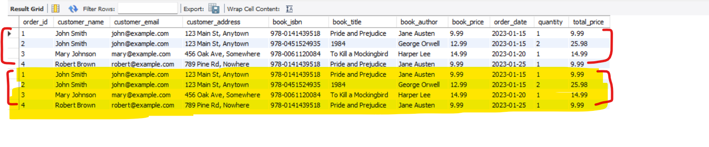
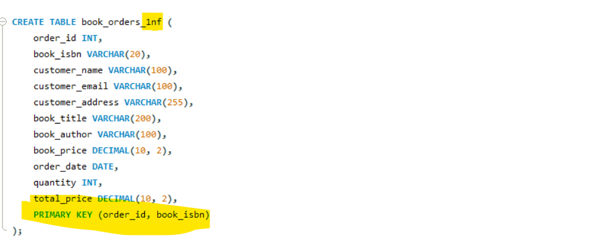

# Database Normalization: 1NF, 2NF, and 3NF Demonstration
# This SQL script demonstrates the process of normalizing a database through
# First, Second, and Third Normal Forms using a bookstore database example.

# Create and use bookstore database
    CREATE DATABASE normalization_db_bookstore;
    USE normalization_db_bookstore;

# Original denormalized table
    CREATE TABLE book_orders (
    order_id INT,
    customer_name VARCHAR(100),
    customer_email VARCHAR(100),
    customer_address VARCHAR(255),
    book_isbn VARCHAR(20),
    book_title VARCHAR(200),
    book_author VARCHAR(100),
    book_price DECIMAL(10, 2),
    order_date DATE,
    quantity INT,
    total_price DECIMAL(10, 2)
    );

# Sample data for denormalized table
    INSERT INTO book_orders VALUES
    (1, 'John Smith', 'john@example.com', '123 Main St, Anytown', '978-0141439518', 'Pride and Prejudice', 'Jane Austen', 9.99, '2023-01-15', 1, 9.99),
    (2, 'John Smith', 'john@example.com', '123 Main St, Anytown', '978-0451524935', '1984', 'George Orwell', 12.99, '2023-01-15', 2, 25.98),
    (3, 'Mary Johnson', 'mary@example.com', '456 Oak Ave, Somewhere', '978-0061120084', 'To Kill a Mockingbird', 'Harper Lee', 14.99, '2023-01-20', 1, 14.99),
    (4, 'Robert Brown', 'robert@example.com', '789 Pine Rd, Nowhere', '978-0141439518', 'Pride and Prejudice', 'Jane Austen', 9.99, '2023-01-25', 1, 9.99);

# View the denormalized data
    SELECT * FROM book_orders;

        Normalization is a process to Organize Data in your Database to Reduce Redundency. There are so many problems in this table. 
        
   [Repeating Data-Increasing Storage Area]

        John smith has done 2 orders. now the problems is in the same tables we are repeating many details like john smith, email & address.
        Suppose if he do 100 orders then do we are going to repeat name, email and address 100 times? [ simple, we are increasing the storage, Because you have no idea. about Normalization ].
        Robert and John has bought the same book, so again we started repeating the same order data like order_id, title, price & author. simply we are increasing the storage just after repeating same data again & again.
    
   [In Case Record got updated]     

        suppose John smith has changed their address so again we need to search for customer and accordingly we need to update/change their
        address. suppose some one has changes their email again for 100 row's we neeed to update manually for particular customer. so multiple
        rows we need to change in this case. 

   [Problems with this current Table Data]
    
        -> For Each Customer Just keep 1 row. 
        -> UPDATE- In one table we added all details like customers, books and address. Suppose some one has changes their email again for 100 row's we neeed to update manually for particular customer
        -> ADD-Y ou can not add Book or Address Without associating with customer.
        -> DELETE- Suppose you want to delete Customer data but all address and Book data also got deleted because they also associated with it.
        -> This Table is in Un-Normalized ( mot in their normal form ). 
        -> Now Break this Table into multiple Tables so that things should not getting repeated this process is called NORMALIZATION.
        -> we have 1NF, 2NF, 3NF. Each & Every NF resolves Issues Progressively.
        -> To Normalize Each Normal Form is Having some set of Rules to Normalize the tables.

# FIRST NORMAL FORM (1NF)
# Requirements:
   -- 1. Each column contains atomic (indivisible) values

   -- 2. Each column contains values of the same type

   -- 3. Each row is unique (typically ensured by a primary key)

   -- 4. No repeating groups of columns

    1. Each column contains atomic (indivisible) values
        Suppose in a table we have a column called PhoneNumbers and we have kept commas separated values. that's not correct.
        you can keep like primary phone-number & secondary phone-number. should not further divisible. you saw like when you ordering
        something then you entered pincode, state, phonenumber, email ...bcz we are dividing and table will be created accordingly.

    2. Each column contains values of the same type
        Suppose you have created a column "contact" and you are storing emails, phone-numbers thats not correct. for eamil should be
        different column and for phone-number should be different columns. 

    3. Each row is unique (typically ensured by a primary key)
        In our case this scenario goes wrong because we have not mentioned like records should be unique. so, atleast one identifier
        should be unique like primary key.  bcz if we see below data we are having the same record once again. 
   

    4. No repeating groups of columns
        Now we had disscussed one example like primary & secondary phone-numbers. so, don't keep like that also because suppose,
        only 1 person is having primary phone rest all stored secondary phone-numbers. so, all person primary having NULL value
        so wasting spaces. suppose if someone having 3 or 4 phone numbers then will add multiple columns only for phone numbers.
        so, in that case how client will get to know which is the active and inactive number for customers.
        so, we can organize or normalize like below.

   # before normalization     
        CREATE TABLE customer (
            customer_id INT PRIMARY KEY,
            name VARCHAR(100),
            email VARCHAR(100),
            phone1 VARCHAR(15),
            phone2 VARCHAR(15),
            phone3 VARCHAR(15)
        );

        INSERT INTO customer VALUES
        (1, 'John Smith', 'john@example.com', '555-1234', '555-5678', NULL),
        (2, 'Mary Johnson', 'mary@example.com', '555-9012', NULL, NULL);

   # after normalization
        
        CREATE TABLE customer (
            customer_id INT PRIMARY KEY,
            name VARCHAR(100),
            email VARCHAR(100)
        );

        CREATE TABLE customer_phone (
            phone_id INT PRIMARY KEY,
            customer_id INT,
            phone_number VARCHAR(15),
            FOREIGN KEY (customer_id) REFERENCES customer(customer_id)
        );

        INSERT INTO customer VALUES
        (1, 'John Smith', 'john@example.com'),
        (2, 'Mary Johnson', 'mary@example.com');

        INSERT INTO customer_phone VALUES
        (1, 1, '555-1234'),
        (2, 1, '555-5678'),
        (3, 2, '555-9012');       

# after 1-NF normalization
    *** the main problem is we are repeating oreder-id bcz there is no unique id.  so if we introduce primary key it will convert into normal
        form. here primary key is a composit(combination of 2 columns). because in one order i want to buy 2 or more than 2 books. 
        bcz if only we made order id as a primary key then 2 nd order for different books it will not allow by a same customer.
        that's the reason we have to make a primary key using both the combinations of columns which is called a composite key.

    CREATE TABLE book_orders_1nf (
    order_id INT,
    book_isbn VARCHAR(20),
    customer_name VARCHAR(100),
    customer_email VARCHAR(100),
    customer_address VARCHAR(255),
    book_title VARCHAR(200),
    book_author VARCHAR(100),
    book_price DECIMAL(10, 2),
    order_date DATE,
    quantity INT,
    total_price DECIMAL(10, 2),
    PRIMARY KEY (order_id, book_isbn)
    );
  

# SECOND NORMAL FORM (2NF)
# Requirements:

   These 2 conditions should be for a table to be in 2nd Normal Form. 
-- 1. Must be in 1NF
-- 2. All non-key attributes must be fully functionally dependent on the entire primary key
     -- (No non-key column should depend on only part of the primary key)
     -- (No partial dependencies on primary key)

   # Problems with 1NF and Resolutions

     Now we have a primary key which is a combination of a order_id & book_isbn which mean book_id.

   

   [Partial dependencies on Primary Key]

     Here customer_name, customer_email and customer_address only depends on order_id and not on book_isbn.
     so, these 3 fields depends on part of primary key.
     similarly, book_title, book_author & book_price only depends on book_isbn not on order_id.
     so, here these all are partial dependencies on primary-key. order_date only depends on order_id.
     only 2 fields or columns which is completely depends on complete primary key. quantity and total_price which depends on both book_id and order_id.
     
     ** Now we have to Break this table so, which all fields having paryial depency on PK they have to move to their own table.
     <> customer_name, customer_email, customer_address & order_date solely depends on order_id.
     <> book_title, book_author, book_price solely depends on book_id/book_isbn.
     <> now quantity and total_price depends on both (order_id + book_isbn).
     <> order_id and book_isbn is the foreign key which depends on table orders and books.

   # before 2NF normalization     
         CREATE TABLE book_orders_1nf (
         order_id INT,
         book_isbn VARCHAR(20),
         customer_name VARCHAR(100),
         customer_email VARCHAR(100),
         customer_address VARCHAR(255),
         book_title VARCHAR(200),
         book_author VARCHAR(100),
         book_price DECIMAL(10, 2),
         order_date DATE,
         quantity INT,
         total_price DECIMAL(10, 2),
         PRIMARY KEY (order_id, book_isbn)
         );

   # after 2NF normalization
     
     CREATE TABLE orders_2nf (
        order_id INT PRIMARY KEY,
        customer_name VARCHAR(100),
        customer_email VARCHAR(100),
        customer_address VARCHAR(255),
        order_date DATE
    );

    CREATE TABLE books_2nf (
        isbn VARCHAR(20) PRIMARY KEY,
        title VARCHAR(200),
        author VARCHAR(100),
        price DECIMAL(10, 2)
    );

    CREATE TABLE order_items_2nf (
        order_id INT,
        book_isbn VARCHAR(20),
        quantity INT,
        total_price DECIMAL(10, 2),
        PRIMARY KEY (order_id, book_isbn),
        FOREIGN KEY (order_id) REFERENCES orders_2nf(order_id),
        FOREIGN KEY (book_isbn) REFERENCES books_2nf(isbn)
    );

   # Sample data for 2NF tables
    INSERT INTO orders_2nf VALUES
    (1, 'John Smith', 'john@example.com', '123 Main St, Anytown', '2023-01-15'),
    (2, 'Mary Johnson', 'mary@example.com', '456 Oak Ave, Somewhere', '2023-01-20'),
    (3, 'Robert Brown', 'robert@example.com', '789 Pine Rd, Nowhere', '2023-01-25');

    INSERT INTO books_2nf VALUES
    ('978-0141439518', 'Pride and Prejudice', 'Jane Austen', 9.99),
    ('978-0451524935', '1984', 'George Orwell', 12.99),
    ('978-0061120084', 'To Kill a Mockingbird', 'Harper Lee', 14.99);

    INSERT INTO order_items_2nf VALUES
    (1, '978-0141439518', 1, 9.99),
    (1, '978-0451524935', 2, 25.98),
    (2, '978-0061120084', 1, 14.99),
    (3, '978-0141439518', 1, 9.99);

  *** Now Every Column in Every Table depends on the Primary Key not on a Part of a Primary Key.

# THIRD NORMAL FORM (3NF)
# Requirements:
   -- 1. Must be in 2NF
   -- 2. Must not have transitive dependencies
       --(A non-key attribute cannot depend on another non-key attribute;
       --it must depend directly on the primary key)

  # Problems with 2NF and Resolutions
     Now we have 3 tables orders, books and order_items. 
     -> In customers now one order placed by a customer. now if i remove customer_email and customer_address then there will be no issue
        because ustomer_email and customer_address directly depends upon customer_name not on order_id. so, here non-key attributes
        directly depends on another non-key attributes. so, now we will introduce a new table only for a customer. 

     -> In orders then we have to create another table orders for an order_date and order_id and that will be associated with a customer.
        order_id will be a primary key and customer_id will be a foreign key.
 
     -> In books table are already in their 3NF. so, here there is no non-key attributes which depends upon anoth non-key attributes.
        -title directly depends on isbn. mean, each isbn uniquely identified specific book with specific title.
        -author directly depends on isbn. each isbn uniquely determine that a specific author has written this book.
        -price directly depends on isbn. each isbn has a specific price.
        -title alone doesn't determine either author or price. bcz with same title there might be multiple books.
        -author can't determine either titer or price.
        -price can not determine either title or author.
     
     ->  In order_items we have to see transitive dependencoes which mean non-key attributes. so non-key attributes are 
         quantity and total_price.
         -generally we say for this book how many quantity for this order. quantity depends on both customer_id and order_id.
         -total_price depends on quantity and book_price which is in books table.
         -so here we are having transitive dependencies, so going to remove the quantity from table.

  # after 2NF normalization

     CREATE TABLE customers_3nf (
          customer_id INT AUTO_INCREMENT PRIMARY KEY,
          name VARCHAR(100),
          email VARCHAR(100),
          address VARCHAR(255)
     );
     
     CREATE TABLE orders_3nf (
          order_id INT PRIMARY KEY,
          customer_id INT,
          order_date DATE,
          FOREIGN KEY (customer_id) REFERENCES customers_3nf(customer_id)
     );
     
     CREATE TABLE books_3nf (
          isbn VARCHAR(20) PRIMARY KEY,
          title VARCHAR(200),
          author VARCHAR(100),
          price DECIMAL(10, 2)
     );
     
     CREATE TABLE order_items_3nf (
          order_id INT,
          book_isbn VARCHAR(20),
          quantity INT,
          PRIMARY KEY (order_id, book_isbn),
          FOREIGN KEY (order_id) REFERENCES orders_3nf(order_id),
          FOREIGN KEY (book_isbn) REFERENCES books_3nf(isbn)
     );

-- Note: The 3NF design removes the derived column total_price from order_items
-- as it can be calculated from quantity * price