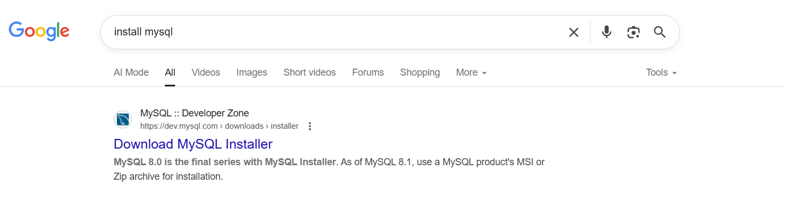
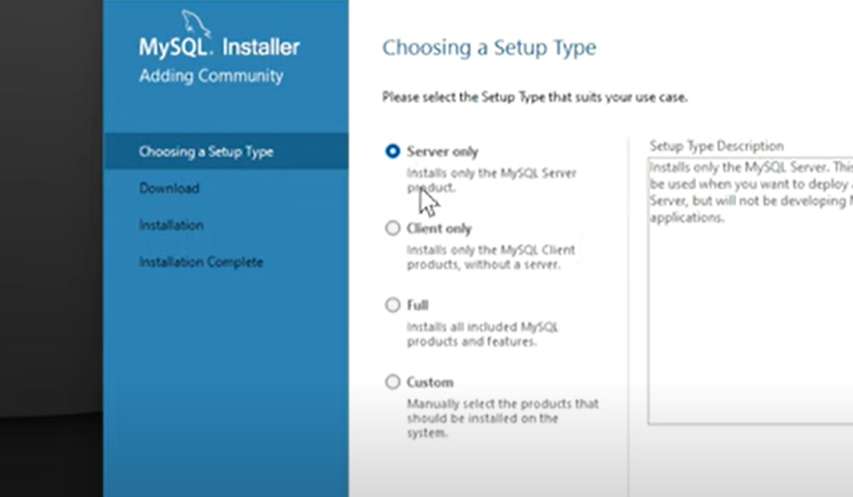
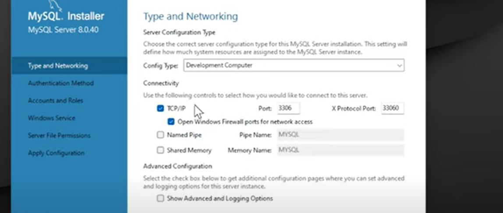
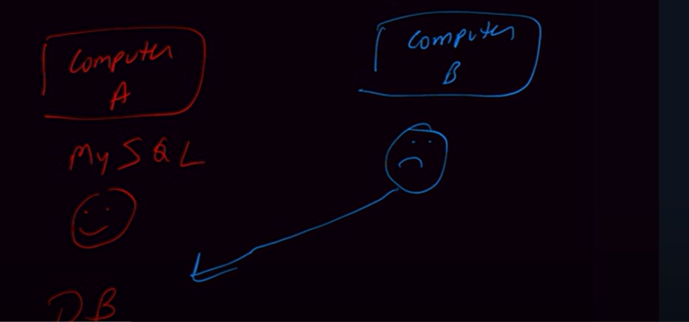
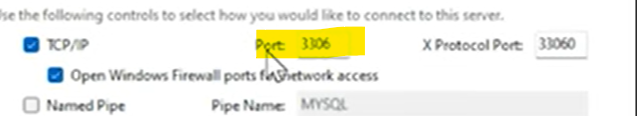
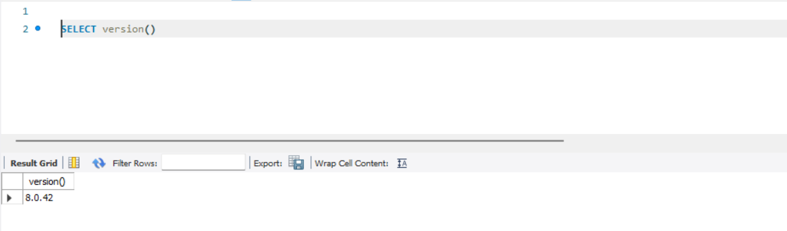
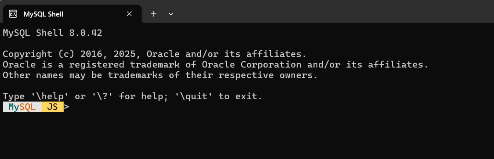
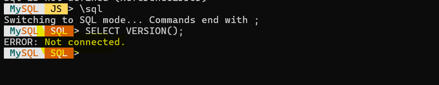
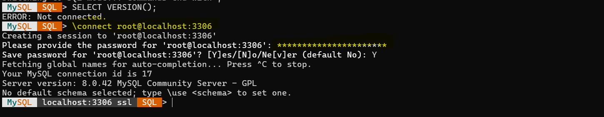
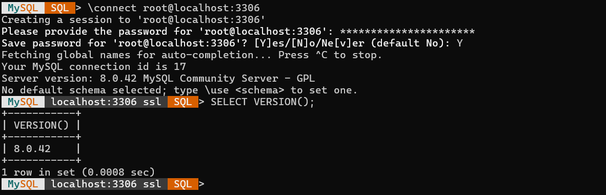

pwd - Uyt@ExeT+XKHPJL#a12345

=> Where do you want your database on your system only so you must have to install server also.

=> It might be your database on another server then by using Client you will connect to database.

=> But we want everything so selected Full.

How do you want to connect with a server
========================================

TCP - Transmission Control Protocol
IP - Internet Protocol

=> How do you want to connect with a server, By default TCP/IP is selected Transmission Control Protocol.

=> TCP is a language using this 2 computers communicates with each other. In Mysql It enables our database to communicate over network.

=> suppose there is 2 computer A and B, In computer A Mysql server is running, computer B wants to access database which in on computer A.
   then how he can access it, He can access with the help of TCP/IP. 

=> TCP/IP is 2 separate protocol but related with each other and work together. 

=> TCP-> TCP handles How our data breaks into small-small pieces which called packets and to make sure all packets
   should be place in a right order and should reach at destination this is called TCP.

=> IP - Internet Protocol which will handles addressing systems like ip addresses like 192.168.1.1, and it makes sures that
   data packets should reach at their right destination. 

  so, TCP handles reliable delivery of data & IP handles where data should go.

=> Port - In our machine at what port you want to run or, you want to run your mysql. 

  

  for example our spring boot app we want to connect with our mysql server then localhost:3306. he should know on which port should connect
  these all things for a same system. but if you want to access from another system db then ip:3306

=> X Protocol port - 33060
 
   3306 port uses fro standard sql expression support regular table based expression.
   In Mysql 8 which supports both slq(3306) & no-sql(33060) which mean it can handles json data as well.

=> 

MYSQL Shell
===========

=> MySQL Command Line Client, It's a Terminal Based Interface.

=> why Mysql JS showing

 MySQL Shell supports 3 modes-
  -MySQL JS - Java Scripts
  -MySQL py - Python
  -MySQL sql - SQL

let's move to SQL mode

=> It's telling you have not connected your shell with a database. you can connect using command \connect root@localhost:3306

