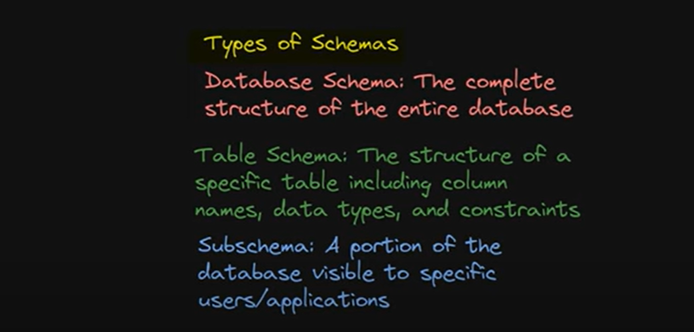
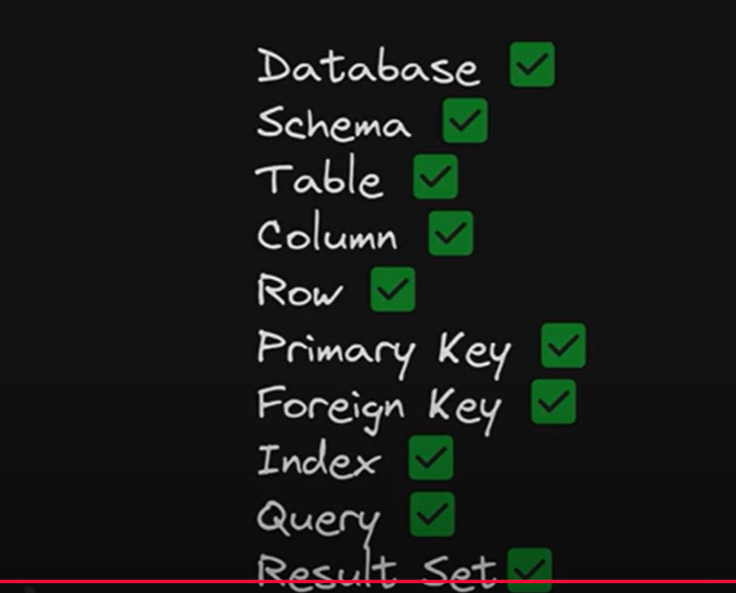
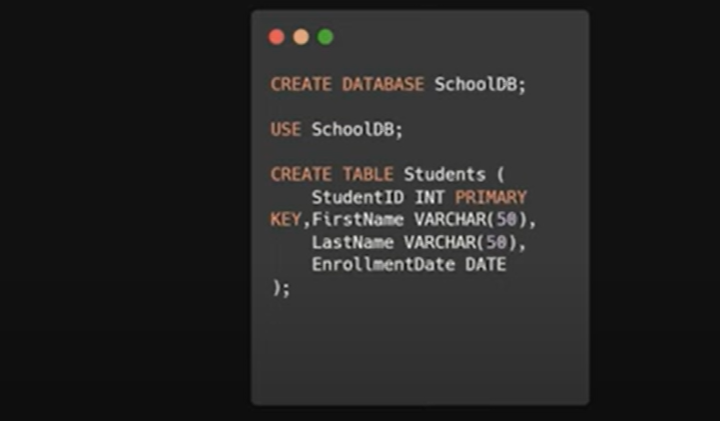
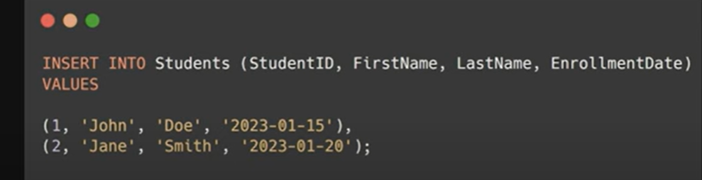

Database - Organized collections of Data.

Schema
========

Types of Schemas
=================

Sub-Schema

  Database 1 portion we make it visible based on who is viewing. suppose In Hospital DB there are so many tables Patient, Billing, Insurance, Doctors.
  
  so for Doctor only 2 table matters Doctor & Patient, Then out of these 4 table we create a VIEW of 2 Tables and in Patients table
  also we will have many columns like phone number email id. we can hide tht for doctor. 
  

Primary Key - Unique Identifier for each row in the table, mean UNIQUE + NOT_NULL. unique data column so that later we can perform some
              operations on it.

Foreign Key - Foreign Key is a Columns which connects 2 tables. 

Index
=======

Assume In a Table Names is stored in a Random fashion. if i will ask to search for an email id of sagar then you will search one by one.
but If i say do Indexing on name, then all names data will be stored in a sorted order like dictionary not in a same table.

