NUMERIC DATA TYPES
====================

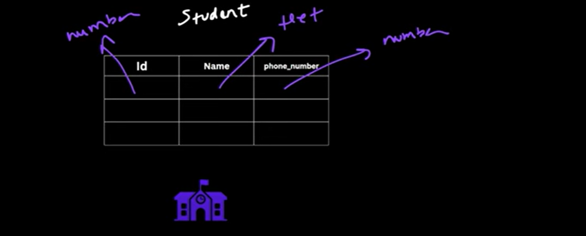

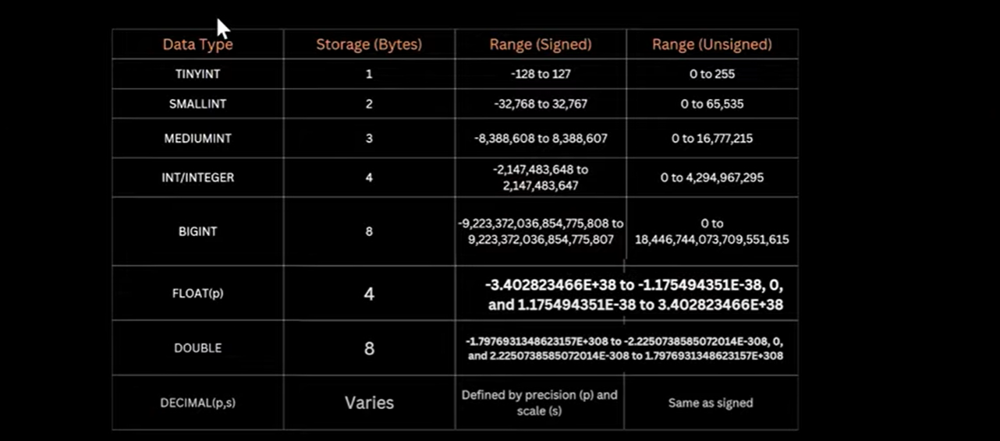

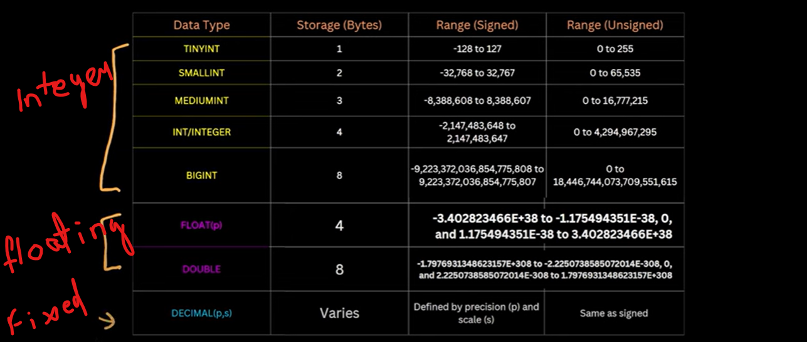

=> FLOAT only can store upto 7 digits

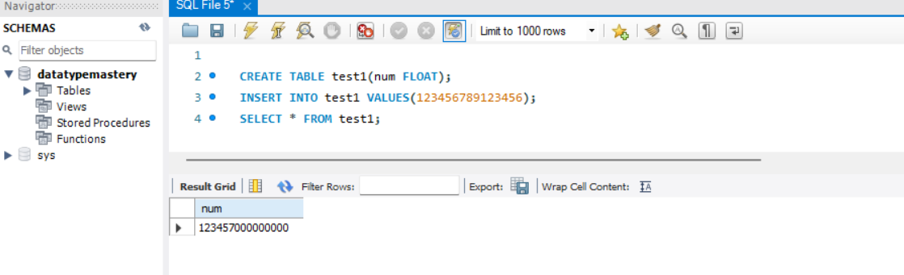

=> DECIMAL(5, 4)   - Total 5 digit after decimal 4 digit

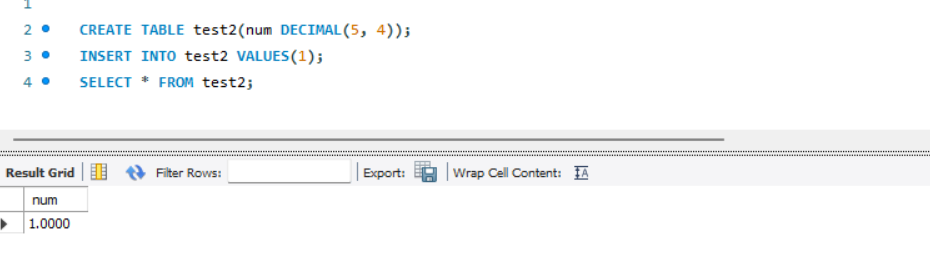

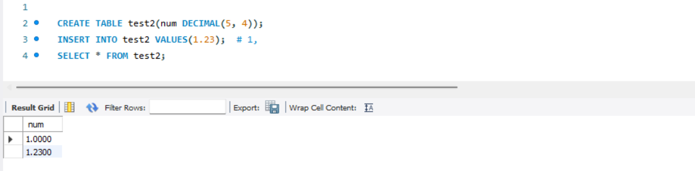

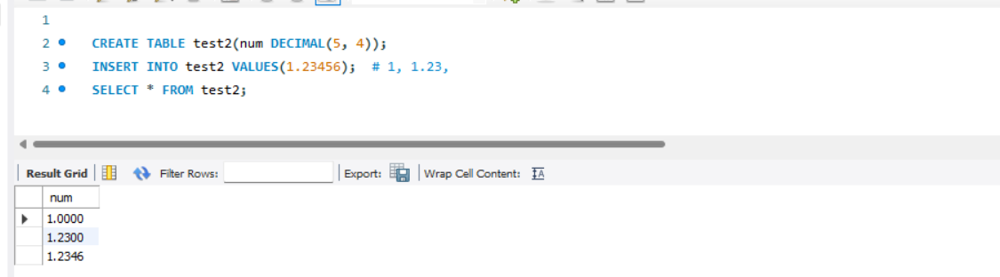

  it's just rounded off the data

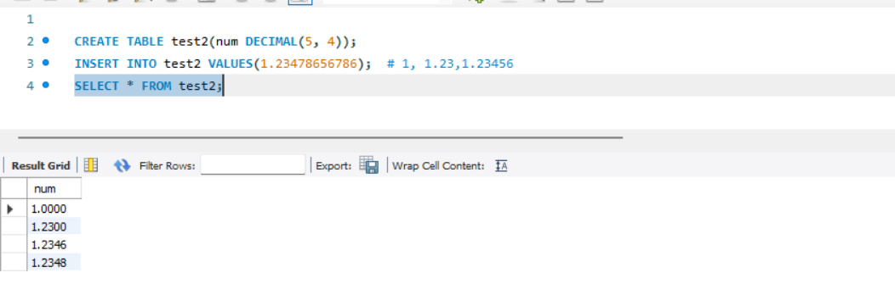

  by default Decimal(10, 0)

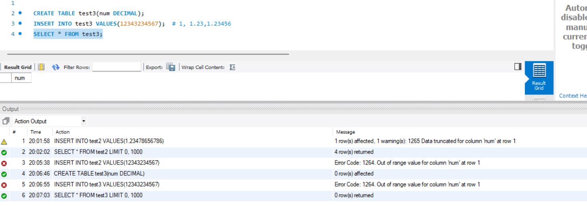

String Data Types
==================

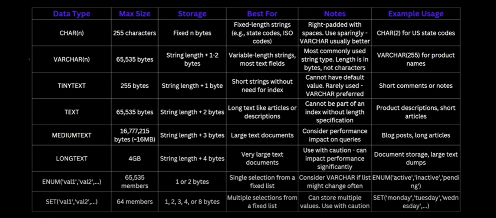

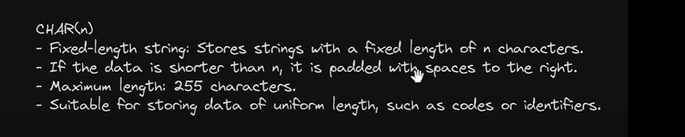

CREATE TABLE product_details (
    product_id INT AUTO_INCREMENT PRIMARY KEY,
    product_code CHAR(10),
    product_name VARCHAR(100),
    short_description TINYTEXT,
    detailed_description TEXT,
    additional_info MEDIUMTEXT,
    full_manual LONGTEXT,
    size ENUM('Small', 'Medium', 'Large'),
    available_colors SET('RED', 'GREEN', 'BLUE', 'BLACK', 'WHITE')
);

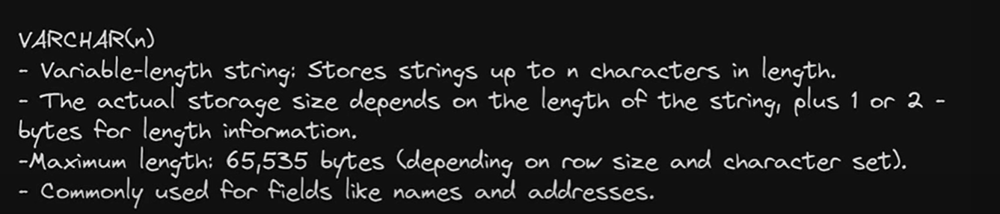

** suppose you store CHAR(4) and giving data 'ab' only 2 byte then it will store 2 blank space 'ab  ' like this, so CHAR is FIXED length
** suppose you store VARCHAR(4) and giving data 'ab' only 2 byte then it will do padding and remove space 'ab' like this

** TEXT data type field will store outside table field row and in table row there would be pointer which point outside text data.

** VARCHAR string data stores into table itself.

** In VARCHAR(n) you define n length but in TEXT you can not.

** While you were using TEXT then it brings data from different location so performance will be slow.

** The Main difference between TEXT & VARCHAR is during Indexing we can fully Index VARCHAR but Text can not, In TEXT we just
    use prefix Indexing only.  which mean if we have a big length character only starting few character only we can do indexing.

** so, TEXT, MEDIUMTEXT, LONGTEXT all stores outside tables only.

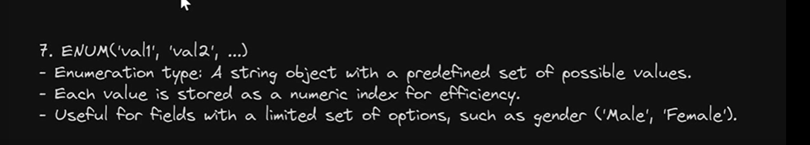

INSERT INTO product_details (
    product_code,
    product_name,
    short_description,
    detailed_description,
    additional_info,
    full_manual,
    size,
    available_colors
) VALUES (
    'PRD1234567',
    'Wireless Headphones',
    'Noise-Canceling Headphones',
    'High-quality headphones with advanced noise-canceling features, Bluetooth 5.0, and 30 hours battery life',
    'Warranty: 2 years. Includes USB-C canle and travel-case',
    'Step: 1 Charge the headphones fully using the provided USB-C cables. Step: 2 Turn on Bluetooth and pair the devices',
    'Medium',
    'Black,White'
);

SELECT * FROM product_details;

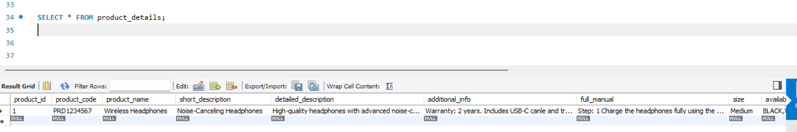

Date & Time Data Types
======================

UTC - Coordinated Universal Time.

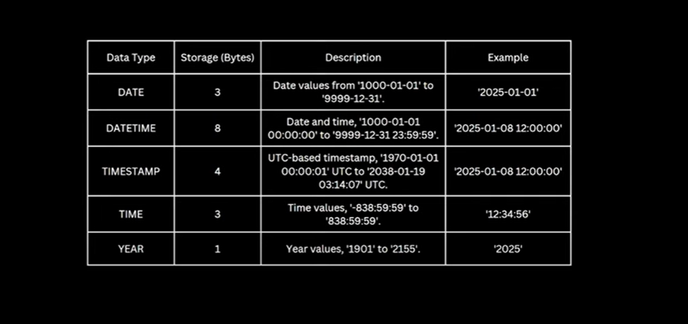

DATE - will store only date value
DATETIME - It will store DATE with TIME
TIMESTAMP - It will store DATE with TIME

we can see Both DATETIME & TIMESTAMP store date and time both but there is some difference.
DATETIME will store a exact data what we have given, In case of TIMESTAMP what time we give it will store into UTC
and when any person retrieve the data then according to that person time zone UTC will get converted. example -
I am in india and given 2025-01-16 14:00:00 but it will store in UTC format which will be different for all locations, 
so, In UTC it would be 5:30 hrs before so in UTC will store 2025-01-16 08:30:00. so suppose there is 2 person one in india another
in Nepal so India person will see as per india time and nepal person will see as per nepal time.

CREATE TABLE EVENTSCHEDULE (
    event_id INT AUTO_INCREMENT PRIMARY KEY,
    event_date DATE,
    event_datetime DATETIME,
    event_timestamp TIMESTAMP,
    event_time TIME,
    event_year YEAR
);

INSERT INTO EVENTSCHEDULE (event_date, event_datetime, event_timestamp, event_time, event_year)
VALUES
    ('2025-01-16', '2025-01-16 14:30:00', '2025-01-16 14:30:00', '14:30:00', 2025),
    ('2025-05-10', '2025-05-10 09:00:00', '2025-05-10 09:30:00', '09:00:00', 2025),
    ('2026-11-20', '2026-11-20 18:45:00', '2026-11-20 18:45:00', '18:45:00', 2026);

SELECT * FROM EventSchedule;

Binary Data Types
===================

Data will store in Binary.

while we store any data like "kaushal" in disk it will store in Binary.

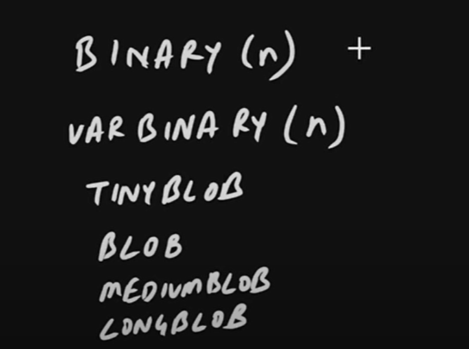

these all datatype is used to handle Binary data.

=> If we have any small binary data like keys or hash then we have to use Binary or VarBinary.

=> If we want to store a large data like image, pdf, file so we have to use TINYBLOB, BLOB, MEDIUMBLOB, LONGBLOB.

=> 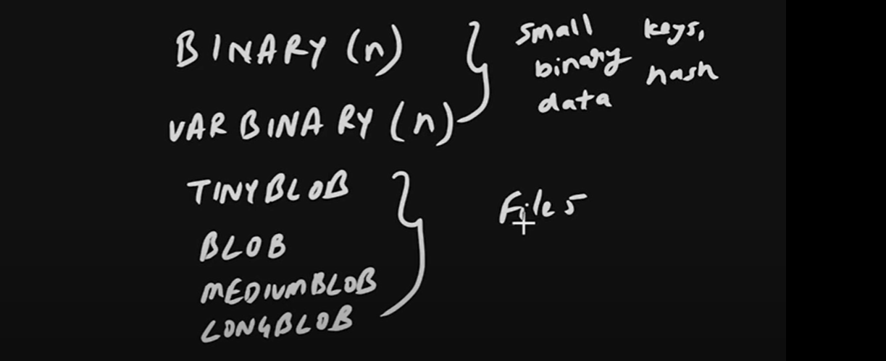

