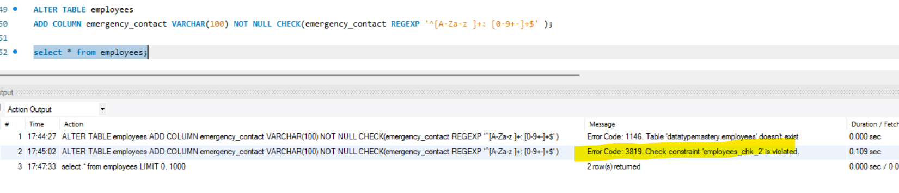
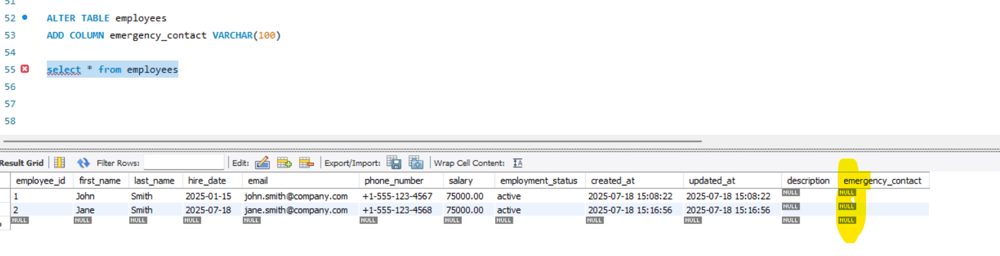
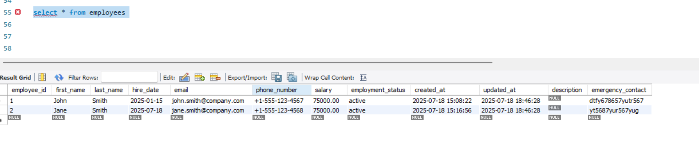
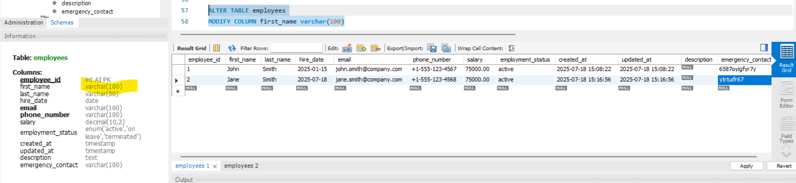
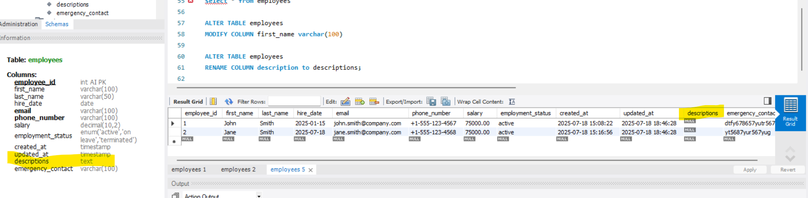
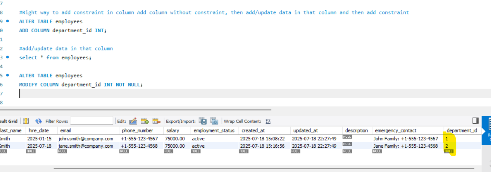
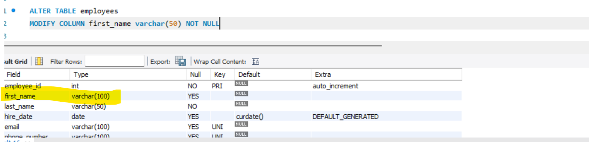

---------------------------------
CREATE / INSERT TABLE COMMAND
-----------------------------------

constraints - constraints is like a Rule like NOT NULL

Constraints - UNIQUE, PRIMARY KEY, NOT NULL, DEFAULT, CHECK

Primary key - unique and not allow null data

UNIQUE column can allow null value

In a Table multiple fields can be unique but in a table only one field would be a primary key.

we are having 2 unique fields email and phone_number.

**=> Both Primary Key and Unique create Index along with the column.

=> auto_increment - If user has given employeeId then it's fine if not then take the highest or last value and increment by 1
   and that value will be a new employee_id for that employee. auto_increment is not any constraints it's a property.

=> Default constraint will insert default value if you are not provided in a column.

=> check - If you want to validate some conditions 

=> created_at & updated_at , If you create any table you should, must have these 2 column.

    create database create_alter_drop_insert;
    use create_alter_drop_insert;
    select database();

    create table employees(
        employee_id int primary key auto_increment,
        first_name varchar(50) not null,
        last_name varchar(50) not null,
        hire_dae date default (current_date()),
        email varchar(100) unique,
        phone_number varchar(100) unique,
        salary decimal(10, 2) check(salary > 0.0),
        employee_status enum('active', 'on leave', 'terminated') default 'active',
        created_at timestamp default current_timestamp,
        updated_at timestamp default current_timestamp on update current_timestamp
    );

    select * from employees;

    insert into employees (
        first_name,
        last_name,
        hire_date,
        email,
        phone_number,
        salary,
        employment_status)
        VALUES (
        'John',
        'Smith',
        '2025-01-15',
        'john.smith@company.com',
        '+1-555-123-4567',
        75000.00,
        'active'
    );

    select * from employees;

    insert into employees (
        first_name,
        last_name,
        email,
        phone_number,
        salary)
        VALUES (
        'Jane',
        'Smith',
        'jane.smith@company.com',
        '+1-555-123-4568',
        75000.00
    );

    CREATE TABLE departments (
        department_id int primary key auto_increment,
        department_name varchar(100) not null,
        location varchar(100),
        created_at timestamp default current_timestamp,
        updated_at timestamp default current_timestamp on update current_timestamp
    );

*** => what we want now we want every employee should have a department_id. so, In Employee Table we want one Field department_id
    which will be foreign_key of department_id of Department table.

*** Now Employee Table Already created and we want to add one field Foreign Key.

---------------------------------
ALTER TABLE / COLUMN COMMAND
-----------------------------------

In employee table we want to add one column description

    ALTER TABLE employees
    ADD COLUMN description text;

    ALTER TABLE employees
    ADD COLUMN emergency_contact VARCHAR(100) NOT NULL CHECK(emergency_contact REGEXP '^[A-Za-z ]+: [0-9+-]+$' );

17:45:02	ALTER TABLE employees ADD COLUMN emergency_contact VARCHAR(100) NOT NULL CHECK(emergency_contact REGEXP '^[A-Za-z ]+: [0-9+-]+$' )	
Error Code: 3819. Check constraint 'employees_chk_2' is violated.	0.109 sec

Because the reason the existing row's will violate this action bcz we have given Not null and once we add column then that row's
having null values for this column

there will be 2 ways to fix this. 
    
    when you do alter then Given a DEFAULT Value also so in existing row's the default value will filled.
    first add column without constraint and filled that value for existing reords and then add constraints using alter

    ALTER TABLE employees
    ADD COLUMN emergency_contact VARCHAR(100)

now we filled the data for existing records and now add a constraints

If you want to Modify Data Type - varchar(50) 5o to 100 we changed

    let me change first_name length to 100

    ALTER TABLE employees
    MODIFY COLUMN first_name varchar(100)
    

we can rename the column as well

    ALTER TABLE employees
    RENAME COLUMN description to descriptions;

If you want to drop column name

    ALTER TABLE employees
    DROP COLUMN temp

Now we want to add constraint

    ALTER TABLE employees
    ADD CHECK(emergency_contact REGEXP '^[A-Za-z ]+: [0-9+-]+$' ); 

If we want to add Not Null for emergency Contact

    ALTER TABLE employees
    MODIFY COLUMN emergency_contact VARCHAR(100) NOT NULL;

--------------------------------
REFERENCE KEY CHANGE
--------------------------------

    INSERT INTO departments (department_name, location) VALUES
    ('IT', 'Building A'),
    ('HR', 'Building B'),
    ('SALES', 'Building C');

   

Foreign Key can be Nullable

If you want to add Not Null in department_id column in employee table.

    ALTER TABLE employees
    ADD COLUMN department_id INT NOT NULL   (Not Recommended)
    
    ALTER TABLE employees
    DROP COLUMN department_id

  Right Way is-

#Right way to add constraint in column Add column without constraint, then add/update data in that column and then add constraint
    
    ALTER TABLE employees
    ADD COLUMN department_id INT;
    
    #add/update data in that column
    select * from employees;
    
    ALTER TABLE employees
    MODIFY COLUMN department_id INT NOT NULL;

Now we have to make this department_id as a foreign key

    ALTER TABLE employees
    ADD FOREIGN KEY (department_id) REFERENCES departments(department_id); 

    DESC employees;

    INSERT INTO employees (
        first_name,
        last_name,
        email,
        phone_number,
        emergency_contact,
        department_id
    )
    VALUES (
        'Michael',
        'Chang',
        'michael.chang@company.com',
        '+1-555-333-4444',
        'ok: 32332',
        2
    );

*** Only One Primary Key will allow in a Table
*** But One Primary Key we can make by combining multiple columns

DROP TABLE employees;

