    create database select_db;
    
    use select_db;

    CREATE TABLE employees (
        id INT AUTO_INCREMENT PRIMARY KEY,
        first_name VARCHAR(50),
        last_name VARCHAR(50),
        department VARCHAR(50),
        salary DECIMAL(10,2),
        hire_date DATE
    );

    INSERT INTO employees (first_name, last_name, department, salary, hire_date) VALUES
    ('John', 'Doe', 'HR', 60000.00, '2022-05-10'),
    ('Jane', 'Smith', 'IT', 75000.00, '2021-08-15'),
    ('Alice', 'Johnson', 'Finance', 82000.00, '2019-03-20'),
    ('Bob', 'Williams', 'IT', 72000.00, '2020-11-25'),
    ('Charlie', 'Brown', 'Marketing', 65000.00, '2023-01-05');

   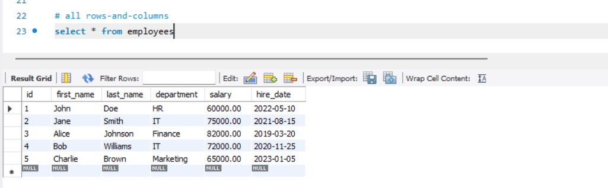

# only first_name and last_name

    select first_name, last_name from employees

# we can change column name in output/result set

    select first_name AS 'First Name', last_name AS 'Last Name', department from employees;
  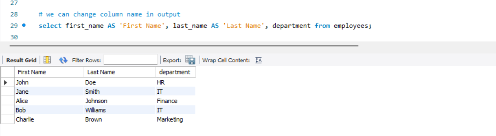
    
# filtering - employees from IT department
    select * from employees where department='IT'
  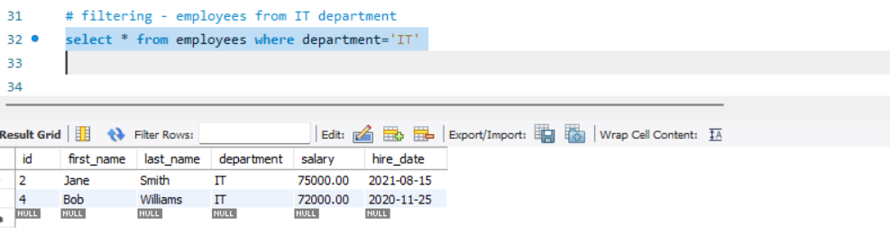

# order by - sort based on salary ascending order
    select * from employees where department='IT' order by salary; 
  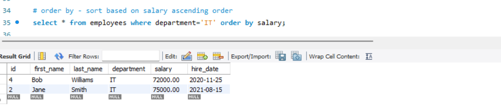

# order by - sort based on salary descending order
    select * from employees where department='IT' order by salary desc;
  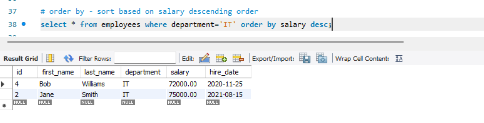

# limit - find only 2 rows from employees
    select * from employees limit 2;
  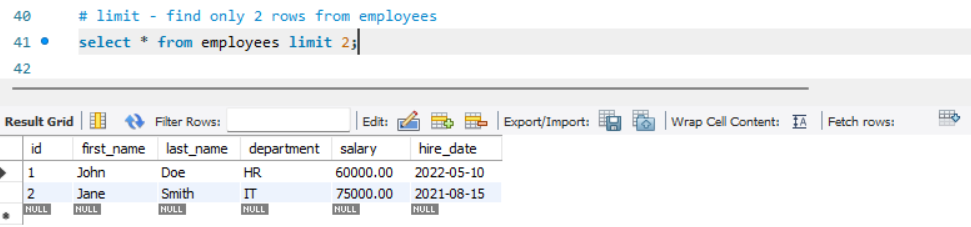

# find the employee whose salary is highest from IT department
    select * from employees where department='IT' order by salary desc limit 1;
  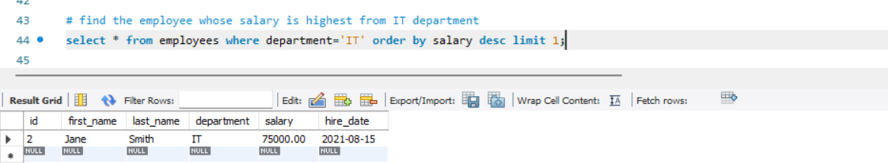 

# distinct - unique department name we want
    select distinct department from employees;
  

# increase salary by 10% - mathematical calculation
    select first_name, last_name, salary * 1.1 AS 'Salary After Raise' from employees;    

# concat first_name and last_name
    select concat(first_name, ' ', last_name) AS 'Full Name' from employees 
  

# employee hire YEAR we want
    select concat(first_name, ' ', last_name) AS 'Full Name' YEAR(hire_date) from employees 
    select concat(first_name, ' ', last_name) AS 'Full Name', YEAR(hire_date), ROUND(salary, 1) from employees where salary > 70000; 
  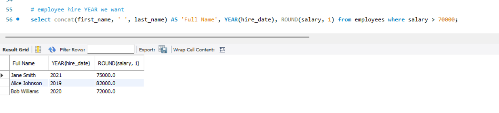

# employees whose salary is more than average salary
    select * from employees where salary > (select avg(salary) from employees);
  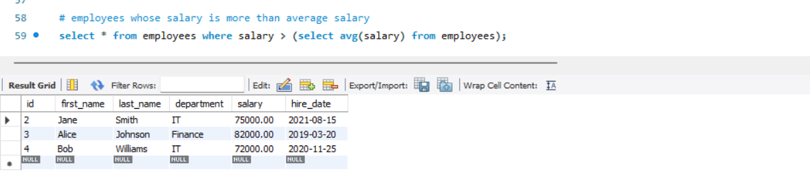

# union - combine employees from IT department and HR department
    select * from employees where department='IT'
    union
    select * from employees where department='HR'
  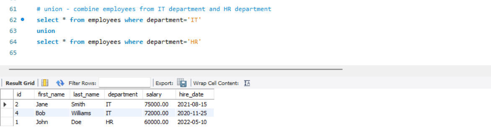

# group by - How many employees in each department
    select department, count(*)
    from employees
    group by (department);
  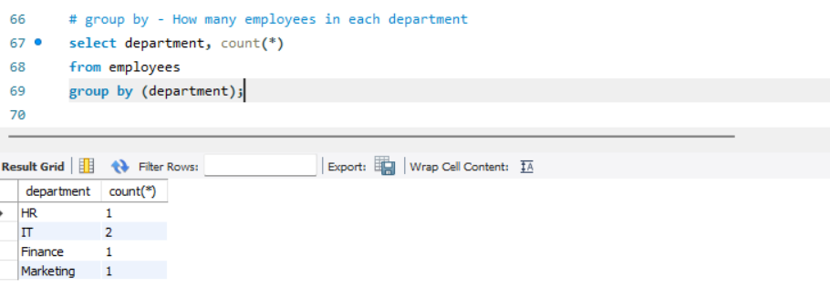

# function
    select NOW();
    select LENGTH('KAUSHAL');
    select 5+2 AS 'sum of 5 and 2';
    select 3<1;