    create database where_bookstore;
    use where_bookstore;

    CREATE TABLE books (
        book_id INT PRIMARY KEY,
        title VARCHAR(100),
        author VARCHAR(50),
        price DECIMAL(10,2),
        publication_date DATE,
        category VARCHAR(30),
        in_stock INT
    );

    INSERT INTO books VALUES
        (1, 'The MySQL Guide', 'John Smith', 29.99, '2023-01-15', 'Technology', 50),
        (2, 'Data Science Basics', 'Sarah Johnson', 34.99, '2023-03-20', 'Technology', 30),
        (3, 'Mystery at Midnight', 'Michael Brown', 19.99, '2023-02-10', 'Mystery', 100),
        (4, 'Cooking Essentials', 'Lisa Anderson', 24.99, '2023-04-05', 'Cooking', 75);

    select * from books;

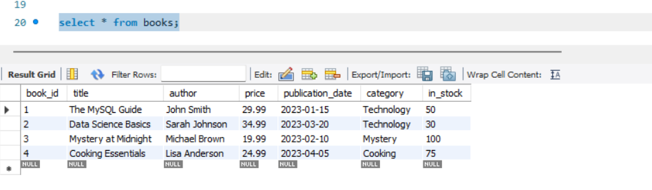

=> where clause uses for Filtering...

# we want Technology's category book

    select * from books where category = 'Technology';
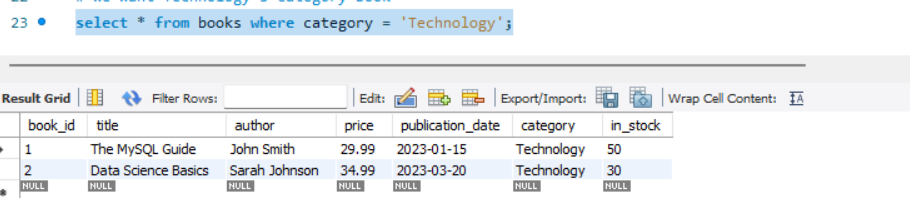

# we can do numeric comparison as well

    select title, price from books where price < 30.00
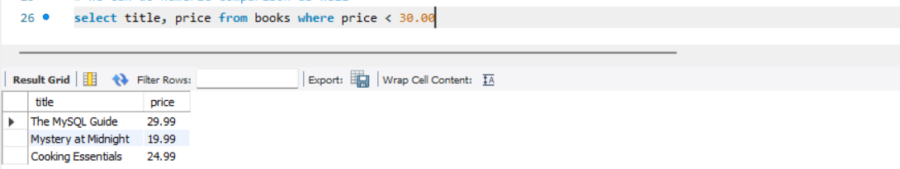

# publication dates should be after 1st march 2023 (Benefit to use Date datatype is we can apply comparison operator on it)
    
    select title, publication_date from books where publication_date >= '2023-03-01'
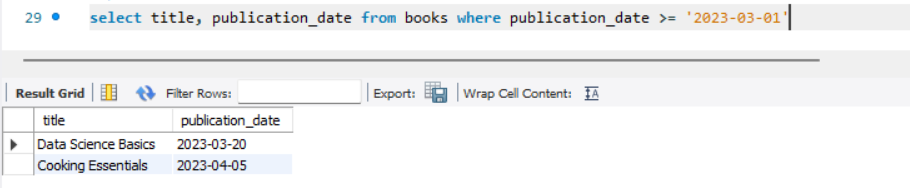

    
Logical Operator
----------------

# Logical Operator (both conditions should apply)

    select * from books where category = 'Technology' and price < 30.00;
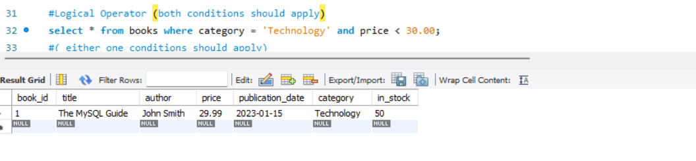

# ( either one conditions should apply)
    select * from books where category = 'Technology' or price < 30.00;
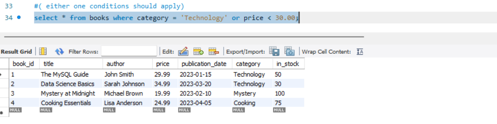

# IN / NOT IN / NOT
    select * from books where category in('Technology', 'Mystery') and price < 30;
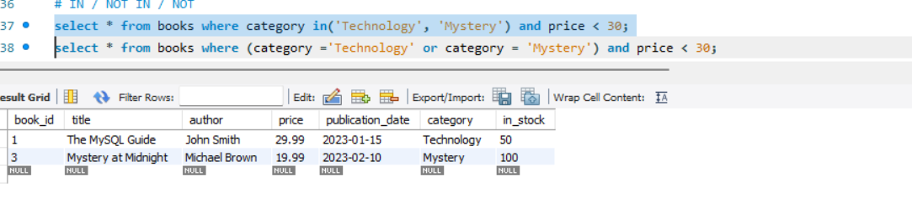

    select * from books where (category ='Technology' or category = 'Mystery') and price < 30;
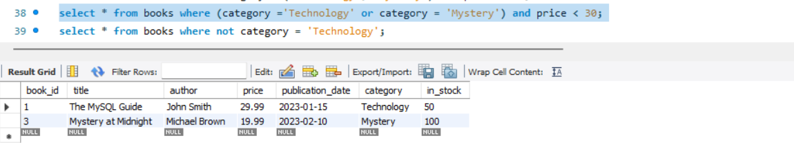

    select * from books where not category = 'Technology';
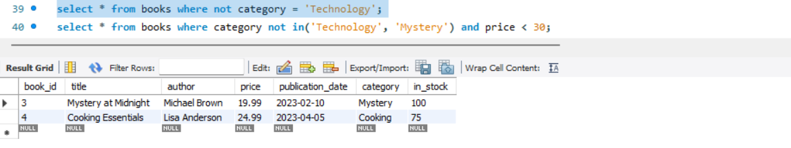
    
    select * from books where category not in('Technology', 'Mystery') and price < 30;
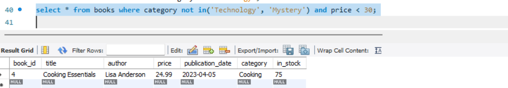

# Finding NULL values
    INSERT INTO books VALUES (5, 'Cook Book', null, 24.99, '2023-04-05', 'Cooking', 75);
    select * from books where author is null;
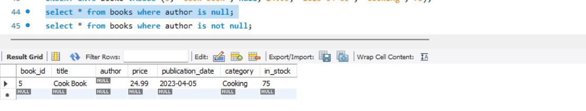

    select * from books where author is not null;
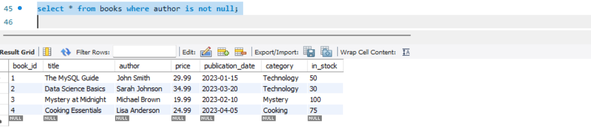

# Pattern Matching - searching in Text data
# find books where title having sql word
    select * from books where title LIKE '%SqL%';
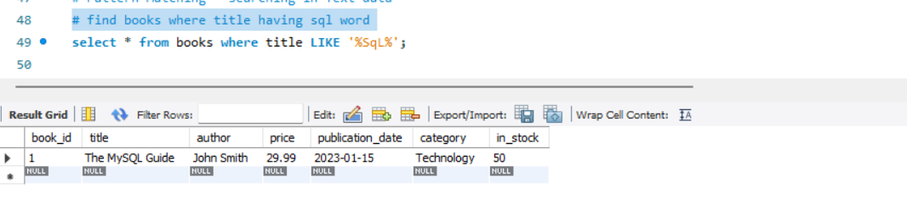

# find books where title starts with The
    select * from books where title LIKE 'The%';
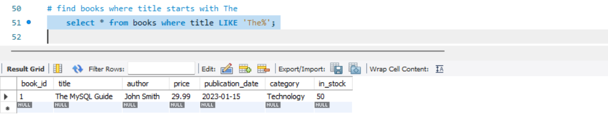

# case-sensitive search ( here we are in forcing to compare characters binary value )
    select * from books where title LIKE binary '%SqL%';
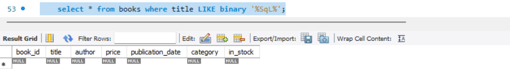

# find books where author having word ohn and that word only 4 character and first character is not known
    INSERT INTO books VALUES (6, 'Mini Cook Book', 'Gohn Smith', 24.99, '2023-04-05', 'Cooking', 75);
    select * from books where author LIKE '_ohn%';
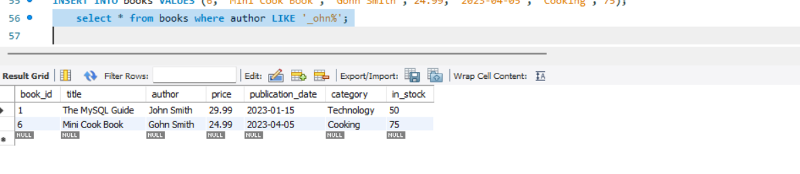

# BETWEEN 
# find books whose price is between 20 and 30
    select * from books where price between 20 and 30;
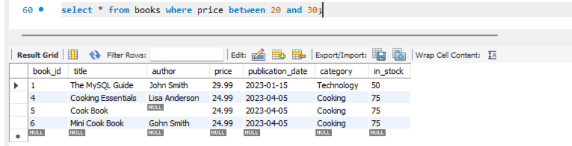

# IN (find books from list of given category)
# find all books which comes under category Technology, Mystery and Science.
    select * from books where category in('Technology','Science','Mystery');
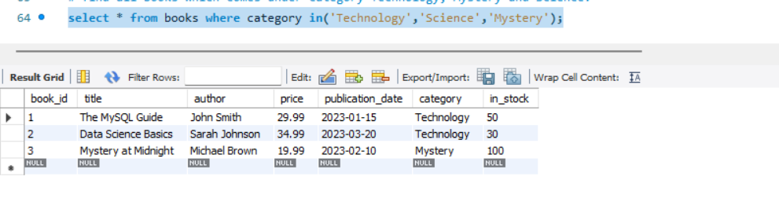

# we need that books only whose price is between 20 to 40 and published after 1st march 2023
    select * from books where price between 20 and 30 and publication_date >= '2023-03-01'
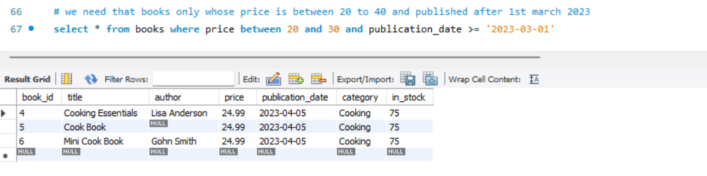

# Sub queries
# we want those books which price is greater than average price
    select * from books where price > (select avg(price) from books);
    select avg(price) from books;
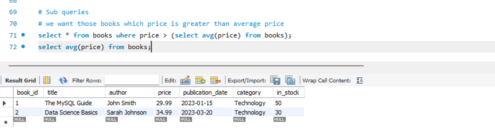

# Sub queries - IN
# select those books which comes under those category whose stock is more than 35
    select * from books where category IN (select category from books where in_stock > 35);
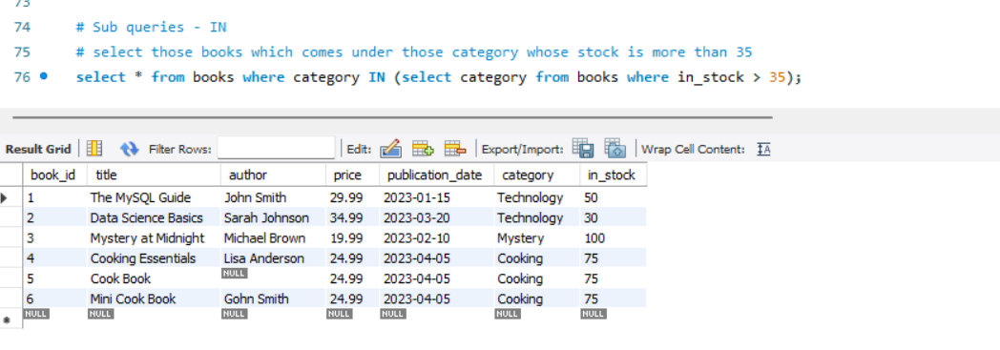

Questions
==============

1. Find All Books Published in 2023 that cost less than the average book price.

        SELECT title, price, publication_date
        FROM books
        WHERE YEAR(publication_date) = 2023
        AND price < (SELECT avg(price) FROM books);

    

2. Find all technology books with "data" in the title that have more than 50 copies in stock.

        SELECT title, category, in_stock
        FROM books
        WHERE category = 'Technology'
        AND title like '%data%'
        AND in_stock > 50;

   

3. Find books that are either in the Technology Category with price > $30 or with the Mystery category with price < $20.

       select title, category, price
       FROM books
       WHERE (category = 'Technology' and price > 30)
       OR (category = 'Mystery' and price < 20);

   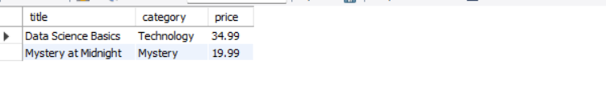

4. List all books where the author's name contains either 'son' or 'th' and were published after March 2023.

       select title, author, publication_date
       FROM books
       WHERE publication_date > '2023-03-31'
       AND author in (SELECT author FROM books WHERE author like '%son%' or author like '%th%');
    
        # OR
    
        SELECT title, author, publication_date
        FROM books
        WHERE (author LIKE '%son%' OR author LIKE '%th%')
        AND publication_date > '2023-03-31';

   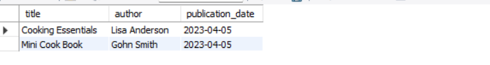

